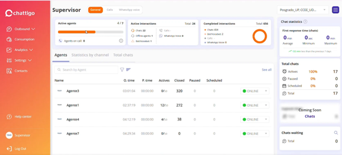
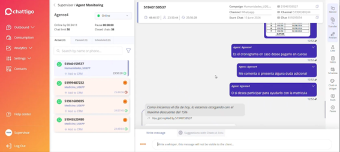
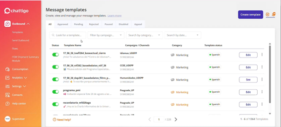
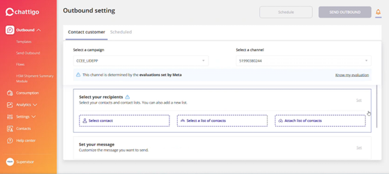
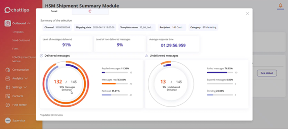
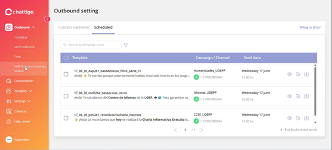
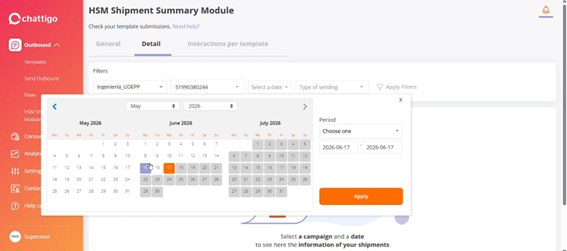
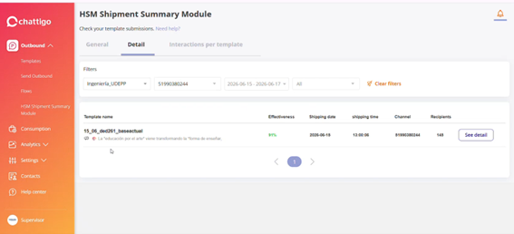
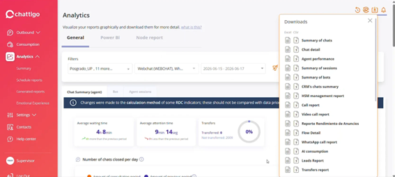
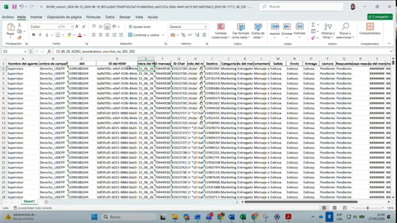

# Chattigo — Referencia de diseño (capturas de UDEP/Adriana)

Capturas reales del Chattigo de UDEP, aportadas por el cliente (Adriana) — material de **benchmark** para diseñar ARIA por encima de Chattigo. Relacionado: `REQUERIMIENTOS-UDEP-MEJORAS.md` (Pilar 9 = reportes, Pilar 1 = programa, Pilar 6 = inbox).

> Binarios en esta carpeta: `1.png` … `10.png` (embebidos abajo). El detalle de texto persiste el conocimiento aunque no se abra la imagen.

---

## 01 — Supervisor · Dashboard General

- **Filtro por programa arriba-derecha:** "Posgrado_UP, CCEE_UD…" → **el dashboard se scopea por programa/campaña** (valida Pilar 1: el programa es el contexto, multi-selección).
- Tabs de canal: **General / Calls / WhatsApp voice**.
- **Active agents:** 4/7 (barra). Agents on call: 0.
- **Active interactions — Total 24:** Chats 22 · Offline agents 1 · Bot/Voicebot 1 · Calls — · WhatsApp Voice 0.
- **Completed interactions — Total 656:** Chats 654 · Bot/Voicebot 2 · Calls — · WhatsApp Voice 0.
- **Chat statistics → First response time (chats):** Average 0 min · Minimum 0 sec · Maximum 0 min · "**133 min less than the previous 7 days**" (comparación vs período anterior).
- **Total chats:** Actives 100% (17) · Paused 0% (0) · Scheduled 0% (0) · Total 17.
- Widget "**Coming Soon · Chats**". **Chats waiting:** Total 0.
- **Tabla de agentes** (tabs: Agents / Statistics by channel / Total chats): columnas **Name · O.time (online) · P.time (pausa) · Actives · Closed · Paused · Scheduled · estado**.
  - Agente3 03:01:04 · 00:00:00 · **0/50** · 320 · 0 · 0 · ONLINE
  - Agente1 02:37:19 · 00:00:00 · **12/50** · 272 · 0 · 0 · ONLINE
  - Agente4 04:12:19 · 00:00:00 · **4/50** · 38 · 0 · 0 · ONLINE
  - Agente7 04:29:34 · 00:00:00 · **0/50** · 0 · 0 · 0 · ONLINE

**Para ARIA:** el KPI de **first-response-time con comparación vs 7 días previos** (R17), el **chat-limit por agente (x/50)**, y online/pause time son referencia directa para nuestra Cola en vivo / Rendimiento de agente. Nuestro plus: cross-canal (no solo chats) + atribución por programa.

---

## 02 — Supervisor · Agent Monitoring (detalle de conversación)

- Agente4 · Online · **Online by 00:34:11** · Pause 00:00:00 · **Chat limit 50** · **Closed chats 38**.
- Tabs **Active(4) / Paused(0) / Scheduled(0)** + buscador por nombre/teléfono + filtro.
- Lista de chats activos, **cada uno etiquetado por programa** y con "**+ Add to CRM**" + timer:
  - 51940159537 · Humanidades_UDEPP · 23:50:28
  - 51999487232 · Medicina_UDEPP · 25:44:56
  - 51961609695 · Medicina_UDEPP · 24:57:45
  - 51945520480 · Medicina_UDEPP · 24:49:04
- **Header de conversación:** Campaign Humanidades_UDE… · Channel Whatsapp · Start Chat 15 June 2026 · ID 51940159537 · ID Channel 51990380244 · ID Chat 819295054 · timers 48:40:57 / 23:50:44 / 23:50:28.
- Burbujas del agente (envió un **cronograma de pago en cuotas** como imagen): "Es el cronograma en caso desee pagarlo en cuotas" · "Me comenta si presenta alguna duda adicional" · "O si desea participar para ayudarlo con la matrícula". Cliente: "…máximo descuento del 15%".
- **Rail de acciones (der.):** Record · To Transfer · Finalize · CRM · Notes · Schedule · **Chatt-IA Widget** · FAQS · Pause.
- **Composer:** "**Write a whisper, this message will not be visible to the client**" + "**Suggestions with Chatt-IA Beta**".

**Para ARIA:** el supervisor puede abrir cualquier conversación viva, hacer **whisper** al agente, y tiene **sugerencias IA (Chatt-IA Beta)** en el composer. Acciones por chat: Transfer/Finalize/CRM/Notes/Schedule/FAQs. Equivale a nuestro monitor en vivo (#9) + Coach/Copilot — nuestro plus: barge real (Connect), una identidad cross-canal, y "Add to CRM" innecesario (ya está sincronizado).

---

## 03 — Outbound · Message templates

- **Message templates** — tabs **All / Approved / Pending / Rejected / Paused / Disabled / Appeal**.
- Filtros: buscar plantilla · **Filter by campaign** · category · date.
- Columnas: **Status (toggle on/off) · Template Name · Campaigns/Channels · Category · Template status (idioma)**.
- **Convención de nombres confirmada y rica** `fecha_código_base_variante`:
  - `17_06_26_toefl264_baseactual_cierre` — Idiomas_UDEPP / 51990380244 — Marketing — "¡Hola! Te saludamos del *Centro de Idiomas*…"
  - `17_06_26_nif262_basededatos_niif_26` — CCEE_UDEPP — Marketing — "*Nueva edición del Programa Especializa…"
  - `17_06_26_dap261_basededatos_filtro_p…` — Humanidades_UDEPP — Marketing — "¡Hola! 👋 Te escribo porque anteriormente h…"
  - `programa_pmi` — Posgrado_UP — "Invitación especial Este 20 de agosto…"
  - `recordatorio_mfd20ago` — Posgrado_UP — "¡Hoy es la Charla Informativa…"
- **Escala: "1-6 of 1364 Templates" · página 1/228.**

**Para ARIA (clave):** **1.364 plantillas** es un problema de escala enorme. Confirma por qué codifican metadatos en el nombre (no tienen campos estructurados). Nuestro plus (Pilar 9): **programa/base/fecha/variante como campos estructurados** + búsqueda/filtros por programa + estados (toggle, Meta status, idioma) — y dejar de depender de parsear el nombre. Gestión de plantillas a esta escala = filtros, agrupación por programa, y catálogo reutilizable.

---

## 04 — Outbound · Send (Outbound setting)

- Tabs **Contact customer / Scheduled**. Botones **Schedule** y **SEND OUTBOUND**.
- **Select a campaign:** CCEE_UDEPP. **Select a channel:** 51990380244.
- Aviso: "**This channel is determined by the evaluations set by Meta**" + "**Know my evaluation**" (calidad/limite del número).
- **Select your recipients:** Select contact · **Select a list of contacts** · **Attach list of contacts** (nueva lista).
- **Set your message** (personalizar el mensaje a enviar).

**Para ARIA:** envío scopeado por campaña/programa, canal atado a la **evaluación de Meta** (quality rating visible — Pilar 4), 3 vías de destinatarios (individual / lista guardada / adjuntar lista). Nuestro plus: el **motor de supresión** (Pilar 3) corre aquí con preview "X excluidos" antes de enviar; y origen desde Leads/programa directamente.

---

## 05 — HSM Shipment Summary · See detail (⭐ el reporte estrella)

Modal "Detail" del módulo HSM Shipment Summary — **el benchmark exacto del reporte que Adriana más usa**.

- **Summary of the selection:** Channel 51990380244 · Shipping date 2026-06-15 13:00:06 · Template name `15_06_ded…` · Recipient **145** Contacts · Category Marketing.
- **Level of messages delivered: 91%** · **non-delivered: 9%** · **Average response time: 01:29:56.959**.
- **Delivered messages — 132/145 (91%):**
  - Replied messages **11.36% → 15**
  - Messages read **53.03% → 70**
  - Not read **35.61% → 47**
- **Undelivered messages — 13/145 (9%):**
  - Failed messages **76.92% → 10**
  - Expired messages **0.00% → 0**
  - Pending **23.08% → 3**
- "Updated 38 minutos".

**Para ARIA (esto debe igualar #6 HSM Outbound y superarlo):** métricas a replicar por envío/plantilla: **delivered % · non-delivered % · avg response time · replied/read/not-read (con conteo) · failed/expired/pending (con conteo)**. Nuestro plus (Pilar 9): mismo detalle **+ cross-canal + atribución golpes→conversión + costo + alertas por umbral + self-serve**, con `delivered/read/replied/failed/expired/pending` poblados por el `whatsapp-status-webhook` (#14, Pilar 4).

---

## 06 — Outbound · Scheduled (envíos programados)

- Tab **Scheduled** (junto a Contact customer) + "What is this?". Buscador por nombre de plantilla + filtro.
- Columnas: ☑ · **Template** · **Campaign / Channel** · **Send date** · acciones (preview 👁 · reprogramar ↺ · descargar ⬇).
- **3 envíos programados** (1-3 of 3), todos para **Wednesday 17 June** a hora exacta:
  - `17_06_26_dap261_basededatos_filtro_parte_01` · Humanidades_UDEPP +51990380244 · **15:00 hs**
  - `17_06_26_toefl264_baseactual_cierre` · Idiomas_UDEPP +51990380244 · **15:30 hs**
  - `17_06_26_pmi261_recordatoriocharla_inscritos` · CCEE_UDEPP +51990380244 · **17:00 hs**

**Para ARIA:** cola de envíos programados con hora exacta por campaña/canal + preview/reprogramar/cancelar. La convención de nombres es aún más rica: `fecha_código_base_variante_segmento` (`…filtro_parte_01`, `…recordatoriocharla_inscritos`) → otra razón para campos estructurados (Pilar 9) en vez de string-parsing.

---

## 07 — HSM Summary · Detail (filtros + selector de rango)

- Filtros del reporte: **campaña** (Ingeniería_UDEPP) · **canal** (51990380244) · **Select a date** · **Type of sending** · Apply Filters.
- **Date range picker:** 3 meses a la vez (May/Jun/Jul 2026), presets "**Period: Choose one**", rango from–to (2026-06-17 → 2026-06-17), botón Apply.
- **Empty state:** "Select a campaign and a date to see here the information of your shipments".

**Para ARIA:** el reporte se filtra por campaña + canal + **rango de fechas** + **tipo de envío**; picker de rango con presets de período; empty-state que guía. Replicar en el report builder (Pilar 9).

---

## 08 — HSM Summary · Detail (resultado en lista)

- Filtros aplicados: Ingeniería_UDEPP · 51990380244 · **2026-06-15 – 2026-06-17** · All · Clear filters.
- Tabla: **Template name · Effectiveness · Shipping date · shipping time · Channel · Recipients · See detail**.
  - `15_06_ded261_baseactual` ("La *educación por el arte* viene transformando la *forma de enseñar*") · **91%** · 2026-06-15 · 13:00:06 · 51990380244 · **145** · See detail.
- "See detail" abre el modal de la captura **05**.

---

## 09 — Analytics · General (⭐ catálogo completo de reportes)

- Analytics → tabs **General / Power Bi / Node report**. "Visualize your reports graphically and download them."
- Filtros: **multi-programa** ("Posgrado_UP, **11 more**…") · canal ("Webchat (WEBCHAT), Wh…") · rango de fechas (2026-06-15 – 2026-06-17).
- Sub-tabs: **Chat Summary (agent) / Bot / Agent sessions**.
- **KPIs con comparación de período:** Average waiting time **4h 8min** (↑4h más) · Average attention time **9min 14seg** (↓1h menos) · Transfers **0%** (Transferred 0 / Not transferred 2009).
- Gráfico "Number of chats closed per day" (período vs período anterior). Banner: cambió el método de cálculo de indicadores RDC (no comparar con datos previos).
- **Downloads (Excel | CSV) — los 15 reportes de Chattigo (LISTA DEFINITIVA a igualar/superar):**
  1. Summary of chats
  2. **Chat detail** (conversación completa por número — lo que Adriana pidió)
  3. **Agent performance**
  4. Summary of sessions
  5. Summary of bots
  6. CRM's chats summary
  7. **HSM management report**
  8. Call report
  9. Video call report
  10. Reporte Rendimiento de Anuncios (ad performance — Meta)
  11. Flow Detail
  12. WhatsApp call report
  13. **AI consumption**
  14. **Leads Report**
  15. Transfers report

**Para ARIA (clave):** esta es la **lista maestra de reportes** del Pilar 9. Mapear cada uno → estado en ARIA (✅ tenemos / 🟡 parcial / 🆕). KPIs con comparación período (waiting, attention, transfers) y filtros multi-programa + multi-canal son referencia directa.

---

## 10 — Reporte HSM descargado · Excel (esquema por mensaje)

- Archivo: `RHSM_custom_2026-06-15_2026-06-18_<hash>_2026-06-17T17_48_33Z.xlsx`. Celda E2 ejemplo: `15_06_26_it2261_basededatos_inscritos_ita_261_262`.
- **Columnas (esquema exacto del export por mensaje):** Nombre del agente · Nombre de campaña · **did** · **ID del HSM** · **Nombre del HSM** (plantilla) · ID mensaje · **ID Chat** · Contenido del mensaje · **Destino** (teléfono) · Categoría · **Estado del mensaje** · Comentario · **Salida** · **Envío** · **Entrega** · **Lectura** · **Respuesta** · Mensaje respuesta · Fecha del mensaje · …
- Valores de fila: Supervisor · Derecho_UDEPP · 51990380244 · `<uuid>` · 15_06_26 · `<id>` · `<idchat>` · "¡Hola!🎓…" · `<phone>` · Marketing · **Entregado** · Mensaje e… · **Exitosa** · **Exitoso** · **Exitoso** · **Pendiente** · **Pendiente** · …

**Para ARIA:** este es el **modelo de datos del export granular** que debe producir nuestro reporte HSM (Pilar 9), poblado por el `whatsapp-status-webhook` (#14). Notar estados separados: *Estado del mensaje* (Entregado), *Salida* (Exitosa), y *Envío/Entrega/Lectura/Respuesta* (Exitoso/Pendiente) — granularidad por etapa del ciclo de vida.

---

## Síntesis para el diseño
1. **Programa es el contexto operativo** en todo Chattigo (filtro de dashboard, etiqueta de chat, scope de plantillas y envíos) → valida Pilar 1.
2. **Su reporte estrella (05)** define el set mínimo de métricas de deliverability → Pilar 9 lo iguala y suma cross-canal/atribución.
3. **Escala real: 1.364 plantillas** → necesitamos campos estructurados + filtros por programa, no nombres parseados.
4. **Supervisión viva (01/02):** whisper, sugerencias IA, chat-limit por agente, first-response-time vs 7 días → referencia para Cola en vivo / Rendimiento de agente.
5. **Mono-canal:** todo es WhatsApp (chat) — nuestro diferencial es la omnicanalidad real (Pilar 6) y la atribución (Pilar 2).
6. **Catálogo de 15 reportes (09):** lista definitiva a igualar/superar en el Pilar 9; el **esquema por mensaje (10)** es el modelo de datos de nuestro export HSM. KPIs con **comparación de período** (01, 09) son patrón a copiar.
7. **Envíos programados (06)** con hora exacta + reprogramar/cancelar → referencia para nuestro scheduler de campañas.

*Set completo — 10 capturas (`1.png` … `10.png`) embebidas arriba.*
