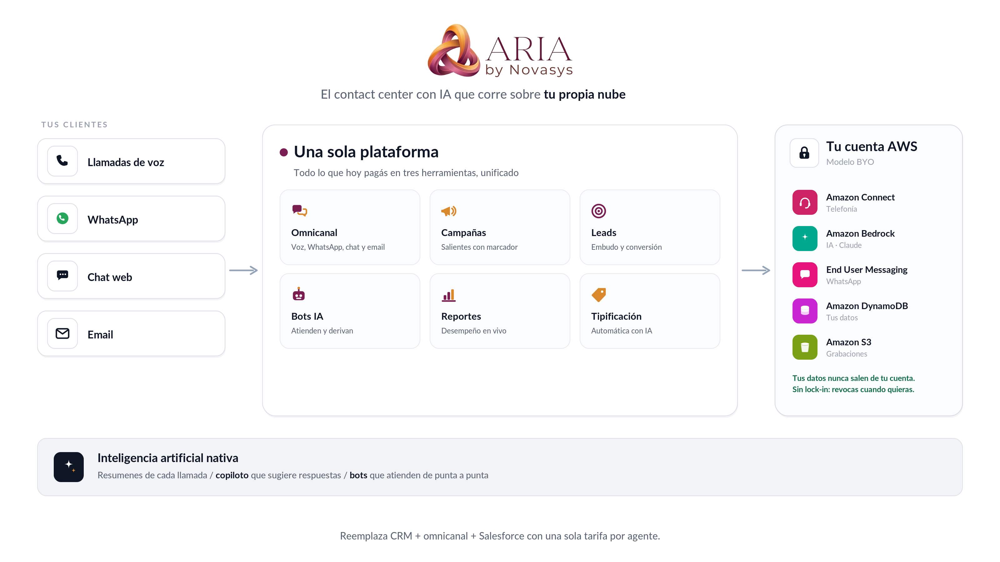

# ARIA — Resumen Comercial

**Documento comercial** · v1.0 · 2026-06-04
Para: clientes, dirección, ventas.

---

## El problema

Hoy un contact center típico paga **tres herramientas separadas** que no se hablan
bien entre sí:

- un **CRM** (tipo Kommo) para leads y embudo,
- una plataforma **omnicanal** (tipo Chattigo) para WhatsApp/chat,
- y un **CRM corporativo** (tipo Salesforce) para la fuerza de ventas.

Resultado: licencias por agente multiplicadas, datos fragmentados, integraciones
frágiles y una factura que crece con cada canal.

## La propuesta: ARIA

**Una sola plataforma** de contact center + CRM, construida sobre **Amazon Connect**,
que unifica **voz, WhatsApp, chat y email**, el **embudo de leads**, las **campañas
de salida**, los **bots con IA** y la **reportería** — todo asistido por inteligencia
artificial (resúmenes de llamada, copiloto del agente, tipificación automática).

> 👉 Para la versión visual de una página (ideal para presentar), ver
> **[arquitectura-comercial.md](arquitectura-comercial.md)**.

---

## Diferenciador central: "Tu nube, tu data" (BYO)

A diferencia de un SaaS tradicional donde tus datos viven en el servidor del
proveedor, ARIA usa el modelo **BYO ("Bring Your Own")**: la plataforma opera sobre
**tu propia cuenta de AWS** —tu Amazon Connect, tu número de WhatsApp, tu IA
(Bedrock), tus datos—.

| Beneficio | Qué significa para ti |
|-----------|-----------------------|
| **Soberanía de datos** | Tus grabaciones, leads y conversaciones **nunca salen de tu cuenta**. Cumplimiento y privacidad bajo tu control. |
| **Sin lock-in** | Si dejas ARIA, tu Amazon Connect y tus datos siguen siendo tuyos. Revocas el acceso con un clic. |
| **Costo transparente** | Pagas AWS **directo** por lo que usas (sin sobreprecio del proveedor sobre la telefonía o la IA). |
| **Seguridad** | ARIA nunca tiene tus credenciales: solo un rol que **tú** creas, con permiso mínimo y revocable. |
| **Escala sin límite** | Infraestructura *serverless*: de 5 a 500 agentes sin cambiar de plan ni aprovisionar servidores. |

---

## Qué obtiene cada rol

- **Agente** — un único escritorio para todos los canales, con softphone, vista 360°
  del cliente y un **copiloto de IA** que sugiere respuestas y resume la llamada.
- **Supervisor** — monitoreo en vivo de colas y agentes (con escucha, susurro y
  *barge*), campañas de salida y reportes de desempeño, sentimiento y riesgo de fuga.
- **Administrador** — alta de la empresa en minutos (asistente 1-clic), gestión del
  equipo, integraciones (Salesforce, WhatsApp) y configuración sin depender de TI.

---

## Inteligencia artificial, nativa

- **Resumen automático** de cada llamada y **tipificación sugerida**.
- **Copiloto** que propone la siguiente mejor acción y respuestas al agente.
- **Bots / Agentes de IA** que atienden WhatsApp de punta a punta y derivan a un
  humano cuando corresponde — corriendo en **tu** Amazon Bedrock.

---

## Modelo económico y ROI

ARIA cobra una **tarifa por agente** simple y única. El cliente paga, además, su
propio consumo de AWS (que de todos modos pagaría) — sin sobreprecio.

| | Piloto (5 agentes) | Pyme (25) | Enterprise (100) |
|--|:--:|:--:|:--:|
| Tarifa ARIA / agente / mes | $39 | $35 | $29 |
| + Consumo AWS propio (estimado) | incluido en tu cuenta | | |
| **Una sola factura de plataforma**, en vez de 3 licencias | ✅ | ✅ | ✅ |

> **Comparación:** sustituir CRM + omnicanal + Salesforce suele costar **$80-200 por
> agente/mes** en licencias combinadas. ARIA unifica eso en una tarifa de plataforma
> de **$29-39/agente** + tu consumo AWS directo (telefonía e IA a precio de costo).

El detalle completo y editable está en la
[calculadora de costos](../tecnico/05-costos.md).

---

## En una frase

> **ARIA** es el contact center omnicanal con IA que corre sobre **tu propia
> nube**: unifica lo que hoy pagas en tres herramientas, te devuelve el control de
> tus datos y escala sin servidores.
