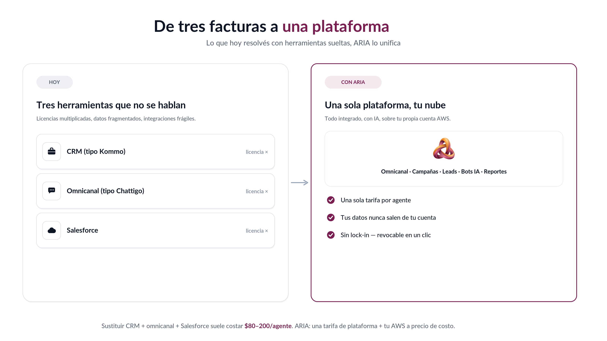

# ARIA — Arquitectura en simple

**Documento comercial** · Para presentar a clientes y dirección.
La versión técnica detallada está en [`../tecnico/`](../tecnico/).

---

## Una plataforma. Tu nube. Con IA.

ARIA unifica **voz, WhatsApp, chat y email**, el **embudo de leads**, las
**campañas** y los **bots con IA** en una sola plataforma — que corre sobre **tu
propia cuenta de AWS**.

> **Cómo leerlo:** tus clientes entran por cualquier canal (izquierda) → ARIA lo
> unifica todo en un solo lugar (centro) → y **todo se ejecuta en tu nube** AWS
> (derecha), con la IA asistiendo en cada paso (abajo).

---

## El problema que resuelve

Hoy un contact center paga **tres herramientas separadas** que no se hablan bien:
un CRM, una plataforma omnicanal y un CRM corporativo. Resultado: licencias
multiplicadas, datos fragmentados e integraciones frágiles.

---

## Cómo funciona, en 3 pasos

| | Paso | Qué pasa |
|--|------|----------|
| 🔗 | **1. Conectás tu nube** | Un asistente de **1 clic** conecta tu Amazon Connect (≈3 min). ARIA nunca toma tus credenciales: creás un rol que controlás y revocás. |
| 🎛️ | **2. Tu equipo opera en ARIA** | Agentes y supervisores trabajan en un solo escritorio omnicanal, con copiloto de IA. **Tus datos viven en tu cuenta.** |
| 📈 | **3. Medís y escalás** | Reportes en vivo, campañas, bots. Sin servidores ni nuevas licencias: escala de 5 a 500 agentes. |

---

## Por qué "tu nube" cambia todo (modelo BYO)

A diferencia de un SaaS tradicional donde tus datos viven en el servidor del
proveedor, ARIA opera sobre **tu propia cuenta de AWS**.

| | Beneficio | Qué significa para ti |
|--|-----------|-----------------------|
| 🛡️ | **Soberanía de datos** | Grabaciones, leads y conversaciones **nunca salen de tu cuenta**. |
| 🔓 | **Sin lock-in** | Si dejás ARIA, tu Connect y tus datos siguen siendo tuyos. Revocás con un clic. |
| 💸 | **Costo transparente** | Pagás AWS **directo** por lo que usás — sin sobreprecio sobre telefonía o IA. |
| 🔐 | **Seguridad** | ARIA no guarda credenciales: solo un rol de permiso mínimo que vos creás. |
| ⚡ | **Escala serverless** | De 5 a 500 agentes sin aprovisionar servidores ni cambiar de plan. |

---

## Lo que obtiene cada rol

- **Agente** — un único escritorio para todos los canales, con softphone, vista 360°
  del cliente y un **copiloto de IA** que sugiere respuestas y resume la llamada.
- **Supervisor** — monitoreo en vivo (escucha, susurro, *barge*), campañas y
  reportes de desempeño, sentimiento y riesgo de fuga.
- **Administrador** — alta de la empresa en minutos, gestión del equipo e
  integraciones, sin depender de TI.

---

## Precio simple

Una **tarifa por agente**, única. El cliente paga además su propio consumo de AWS
(que de todos modos pagaría), **sin sobreprecio**.

| | Piloto (5) | Pyme (25) | Enterprise (100) |
|--|:--:|:--:|:--:|
| Tarifa ARIA / agente / mes | **$39** | **$35** | **$29** |

> Comparación: sustituir CRM + omnicanal + Salesforce suele costar **$80–200 por
> agente/mes** en licencias combinadas. Detalle y calculadora editable:
> [`../tecnico/05-costos.md`](../tecnico/05-costos.md).

---

## En una frase

> **ARIA** es el contact center omnicanal con IA que corre sobre **tu propia
> nube**: unifica lo que hoy pagás en tres herramientas, te devuelve el control de
> tus datos y escala sin servidores.

---

*Gráficos generados desde `arquitectura-aria.html` / `antes-despues.html` con
`node scripts/shoot-html.mjs`. Editables y re-renderizables.*
