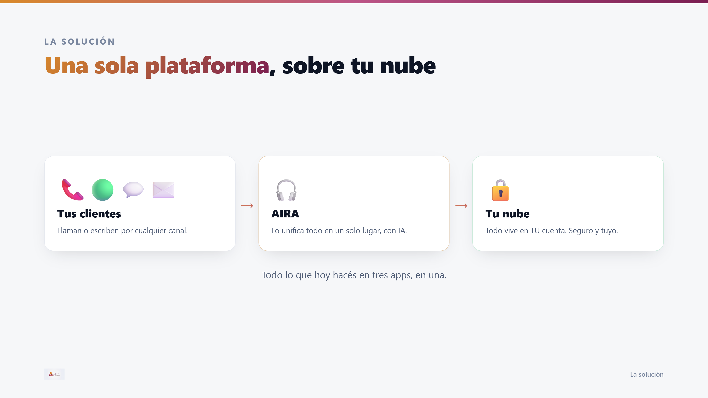
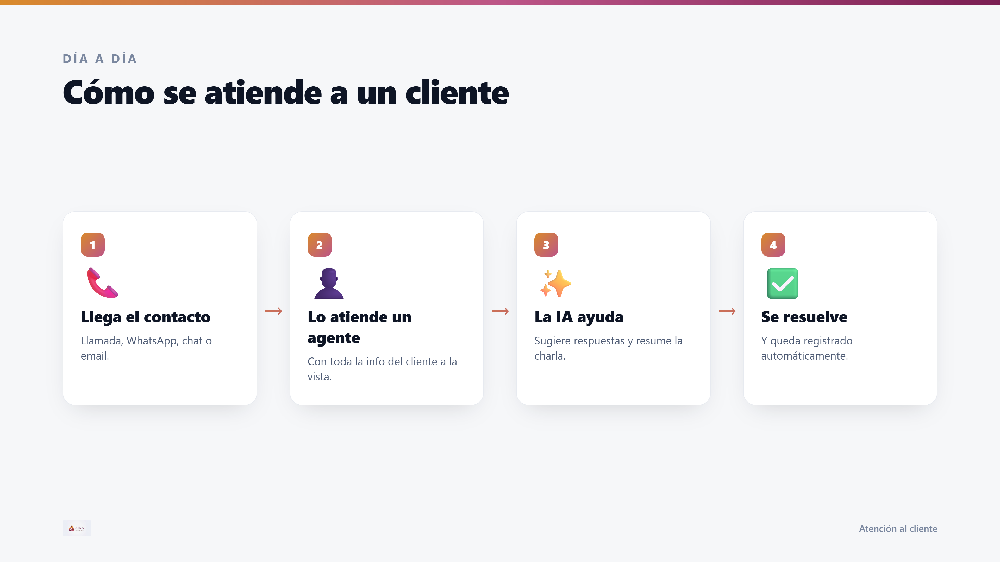
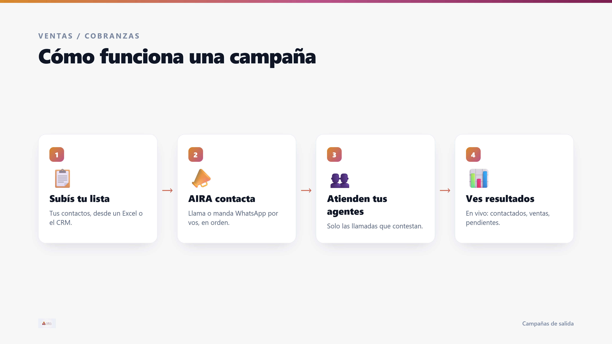
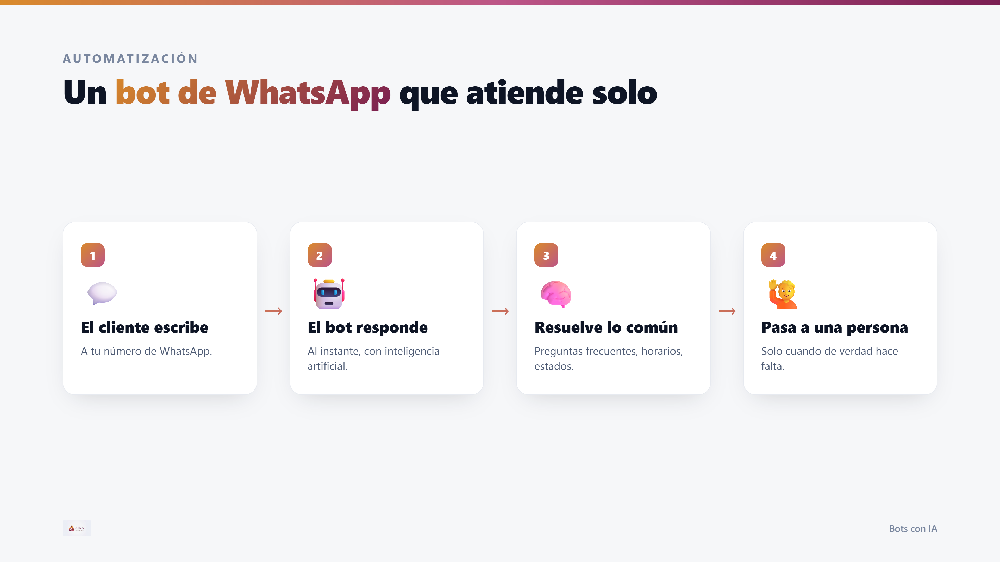
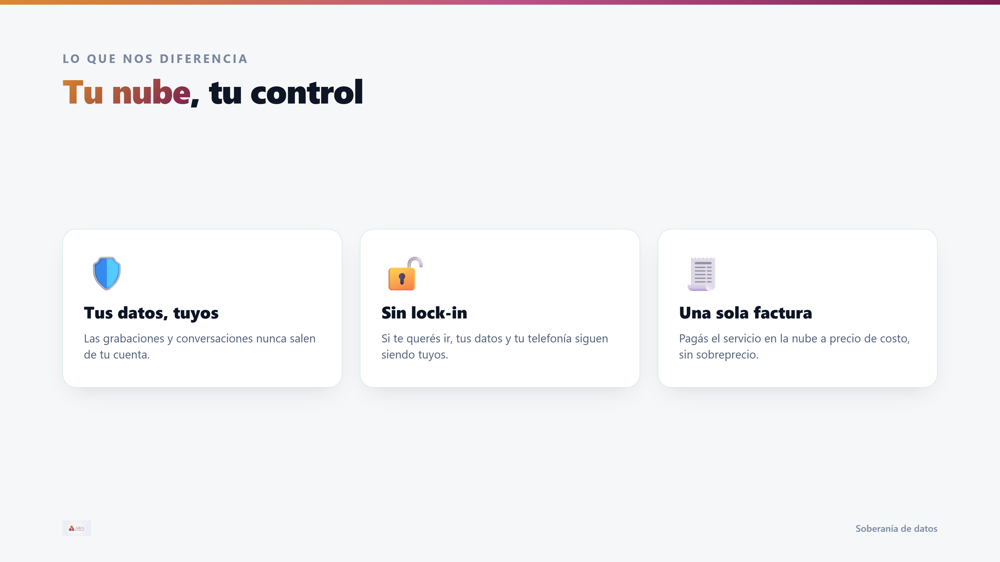
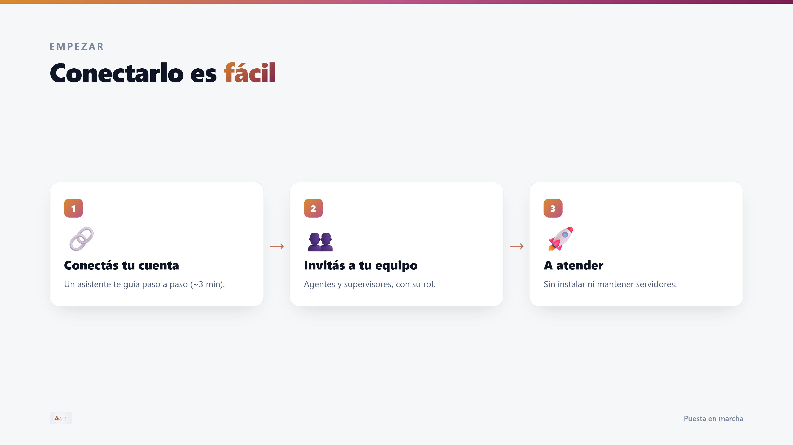

# ARIA — Cómo funciona, en simple

**Documento comercial** · Versión sin tecnicismos, para cualquier audiencia (no
hace falta ser técnico). Es el contenido del [deck de presentación](aria-deck.pdf).

---

## La idea en una imagen

Tus clientes entran por cualquier canal → **ARIA** lo unifica todo en un solo lugar
→ y todo corre sobre **tu propia nube**.

---

## Cómo se atiende a un cliente

---

## Cómo funciona una campaña de salida

---

## Un bot de WhatsApp que atiende solo

---

## Tu nube, tu control

---

## Conectarlo es fácil

---

> **Presentación completa:** [`aria-deck.pdf`](aria-deck.pdf) (9 slides, 16:9) ·
> hoja de una página: [`aria-one-pager.pdf`](aria-one-pager.pdf).
> Las slides sueltas están en [`img/slide-1..9.png`](img/). Se regeneran con
> `node scripts/shoot-html.mjs docs/comercial/deck.html docs/comercial/aria-deck.pdf 1920 1080`.
