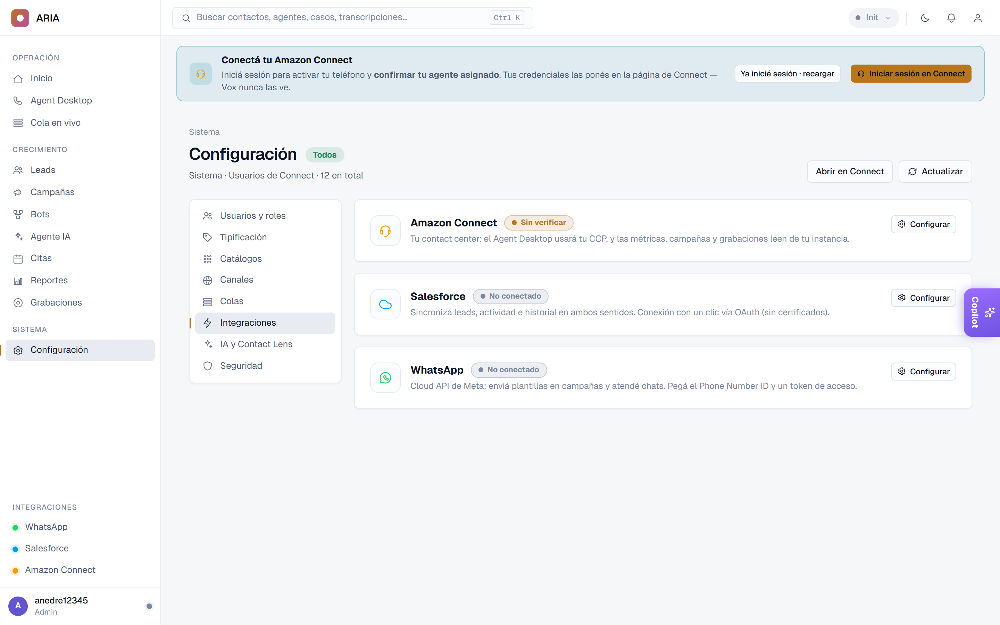
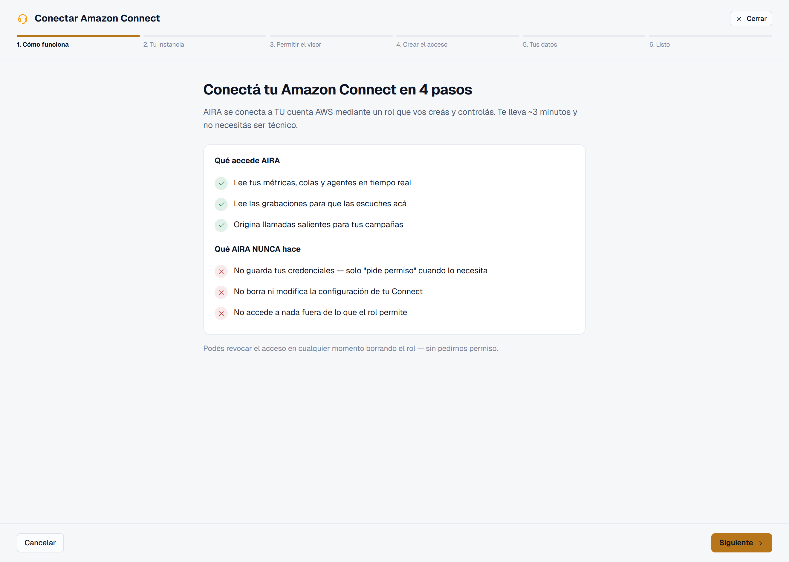
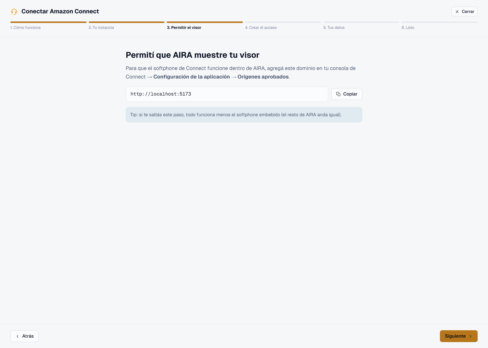
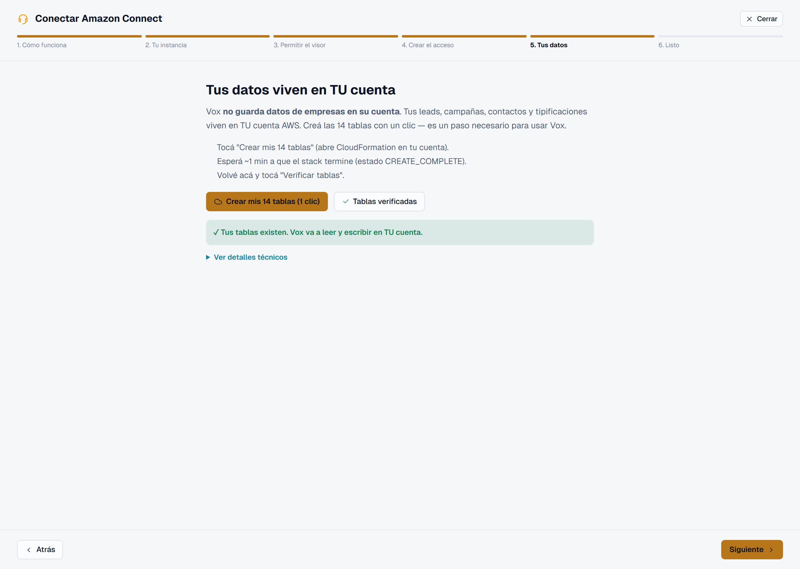
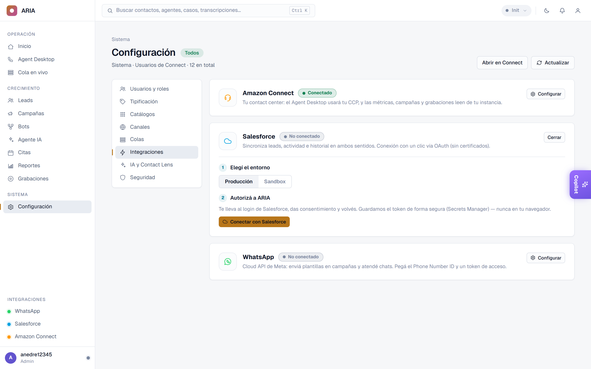
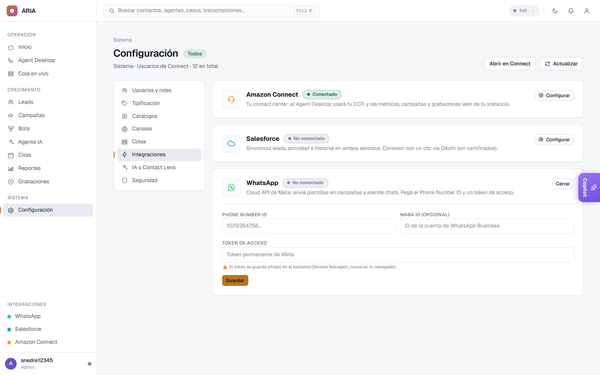

{width=6cm}

# Antes de empezar

ARIA funciona en tu navegador — **no se instala nada**. Para dejar la plataforma
lista, vas a conectar **tu propia cuenta de AWS** una sola vez. Necesitás:

- Una **cuenta de AWS** con una instancia de **Amazon Connect** ya creada.
- Un navegador moderno (**Chrome**, **Edge** o **Firefox**).
- Unos **10 minutos**. No necesitás ser técnico: un asistente te guía paso a paso.

> **Tranquilo:** ARIA nunca toma tus contraseñas. Vos creás un permiso (un "rol")
> que podés revocar cuando quieras.

\newpage

# Paso 0 — Entrar a la configuración

Iniciá sesión como **administrador** y andá a, en el menú de la izquierda,
**Configuración**. Ahí vas a ver la sección **Integraciones**, con una tarjeta para
cada conexión: **Amazon Connect**, **Salesforce** y **WhatsApp**.

{width=16cm}

Empezamos por la principal: **Amazon Connect**. Tocá **"Conectar Amazon Connect"**
y se abre el asistente.

\newpage

# Paso 1 — Conectar Amazon Connect

## 1.1 · Cómo funciona

El asistente te explica, en simple, **qué accede ARIA** (tus métricas, grabaciones y
llamadas salientes) y **qué nunca hace** (no guarda credenciales, no modifica tu
Connect). El acceso es revocable en cualquier momento. Tocá **Siguiente**.

{width=16cm}

\newpage

## 1.2 · Tu instancia

Pegá la **URL de tu instancia** de Amazon Connect (la que usás para entrar a
Connect), elegí su **región** y —recomendado— pegá el **ARN de la instancia**. Con el
ARN, ARIA restringe las acciones sensibles solo a esa instancia.

{width=16cm}

\newpage

## 1.3 · Permitir el visor

Para que el teléfono (softphone) funcione embebido, copiá el **dominio** que muestra
el asistente y agregalo en *Amazon Connect → Configuración de la aplicación →
Orígenes aprobados*. (Si te lo salteás, todo funciona menos el softphone embebido.)

{width=16cm}

\newpage

## 1.4 · Crear el acceso

Tocá **"Crear rol en mi cuenta AWS (1 clic)"**: se abre **CloudFormation** en tu
cuenta con todo pre-cargado. Revisás y das *Crear*. Cuando termina, copiá el
**RoleArn** que aparece en la pestaña "Salidas", pegalo en el campo y tocá
**Verificar conexión**.

{width=16cm}

\newpage

## 1.5 · Tus datos (en tu nube)

ARIA **no guarda los datos de tu empresa** en su cuenta: tus leads, campañas y
contactos viven en **tu** cuenta AWS. Tocá **"Crear mis 14 tablas (1 clic)"**,
esperá ~1 minuto y luego **Verificar tablas**.

{width=16cm}

\newpage

## 1.6 · ¡Listo!

El asistente te muestra el resumen (instancia, rol verificado, datos activados).
Tocá **Guardar y terminar**. Tu Amazon Connect ya está conectado.

{width=16cm}

\newpage

# Paso 2 — Conectar Salesforce *(opcional)*

Si usás Salesforce, conectalo para sincronizar tus leads automáticamente. En
**Configuración → Integraciones**, tocá **"Configurar"** en la tarjeta de Salesforce:

1. **Elegí el entorno**: Producción o Sandbox.
2. **Autorizá a ARIA**: tocá **"Conectar con Salesforce"** — te lleva al login de
   Salesforce, das tu consentimiento y volvés. El token se guarda cifrado (en
   Secrets Manager), nunca en tu navegador.
3. La tarjeta queda en **"Conectado"**. ¡Listo!

{width=16cm}

A partir de ahí, los leads se sincronizan entre ARIA y Salesforce en ambos sentidos.

\newpage

# Paso 3 — Conectar WhatsApp *(opcional)*

Para atender y hacer campañas por WhatsApp desde **tu propio número**, tocá
**"Configurar"** en la tarjeta de WhatsApp y completá:

1. El **Phone Number ID** de tu número (de *AWS End User Messaging*).
2. El **WABA ID** *(opcional)* — el ID de tu cuenta de WhatsApp Business.
3. El **Token de acceso** (token permanente de Meta) — se guarda cifrado en el
   backend, nunca en el navegador.

Tocá **Guardar**. Ya podés enviar plantillas y que tus bots/agentes respondan por
WhatsApp.

{width=16cm}

> Las plantillas que ves al armar una campaña salen de **tu** WhatsApp Business —
> no de un número compartido.

\newpage

# Paso 4 — Invitar a tu equipo

Desde **Configuración → Equipo** sumás a las personas que van a usar ARIA:

1. Tocá **"Invitar usuario"** y completá **nombre**, **correo** y **rol** (Agente,
   Supervisor o Administrador).
2. A cada persona le llega un **correo** con su acceso.
3. Para los agentes, vinculá su usuario con su **agente de Amazon Connect** (el
   agente lo confirma con sus credenciales).

{width=16cm}

\newpage

# Paso 5 — Verificar que todo quedó bien

En **Configuración → Integraciones → Estado de la integración**, ARIA hace un
**diagnóstico** automático y te dice, con un tilde verde o un aviso, si están bien:

- El **rol** de acceso (permiso a tu cuenta).
- La **instancia** de Amazon Connect.
- Las **14 tablas** de datos.
- Las **grabaciones** (bucket S3) y **Contact Lens**.

Si algo aparece en ámbar o rojo, el mismo panel te dice qué revisar.

# ¡Configuración terminada!

Con esto, ARIA ya está lista para tu operación:

- ✅ Amazon Connect conectado (voz y chat).
- ✅ Tus datos en tu propia nube.
- ✅ (Opcional) Salesforce y WhatsApp.
- ✅ Tu equipo invitado.

Ahora cada agente puede entrar y empezar a atender. Para el uso diario, ver el
**Manual de Usuario**.

---

## ¿Necesitás ayuda?

Escribinos a **[ tu correo de soporte aquí ]** y te acompañamos en la puesta en marcha.

*ARIA · by Novasys — Junio 2026*
