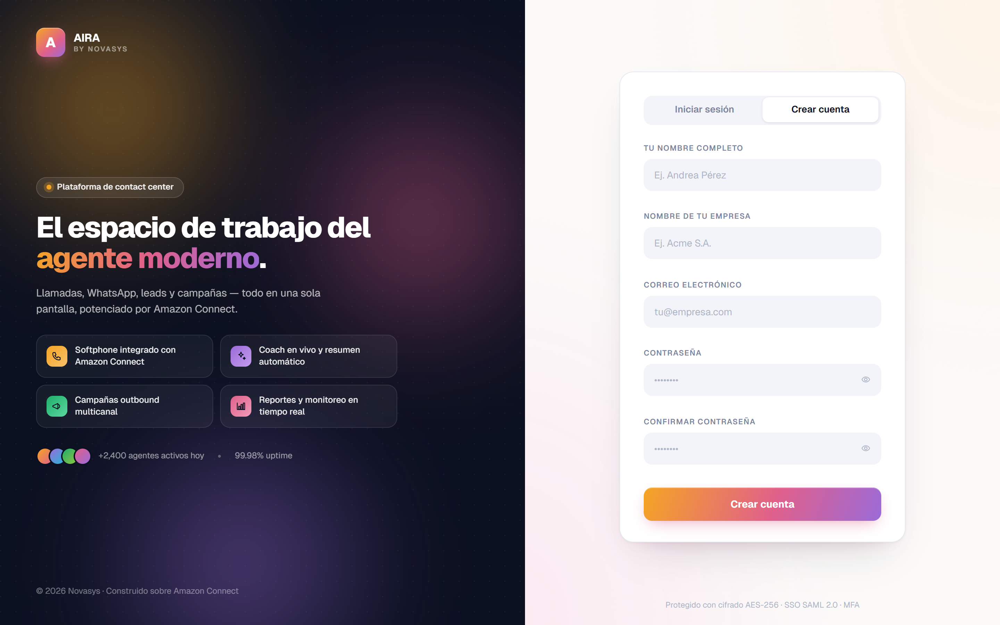
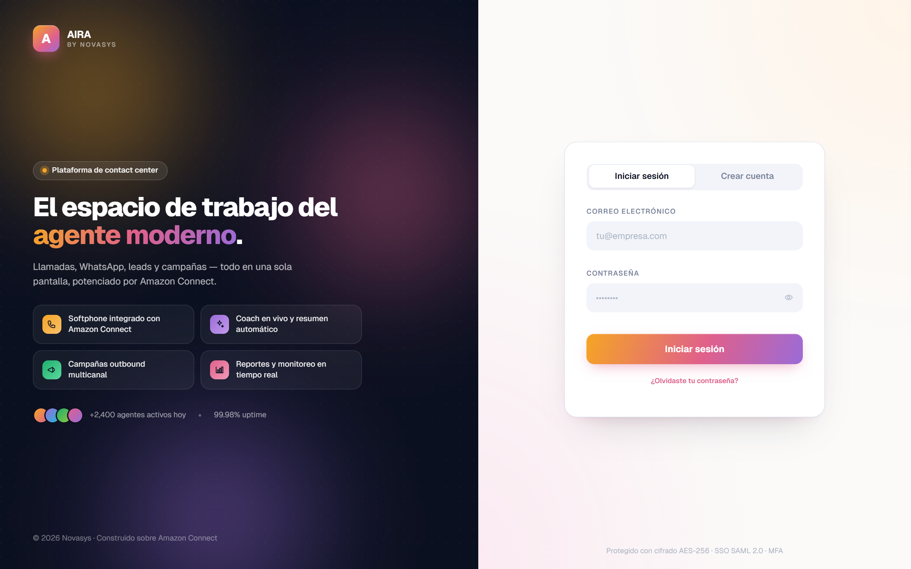
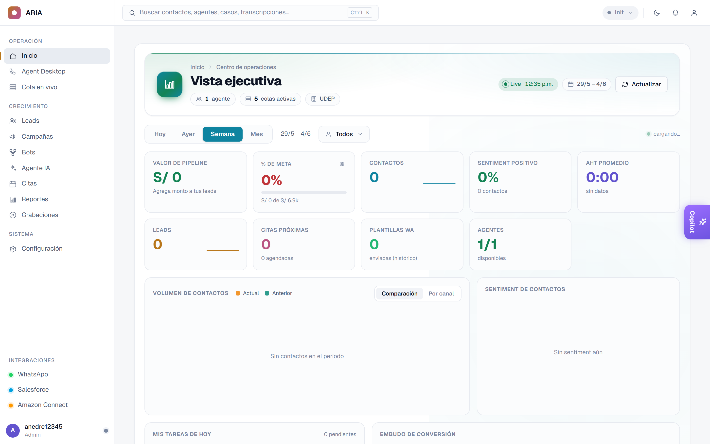
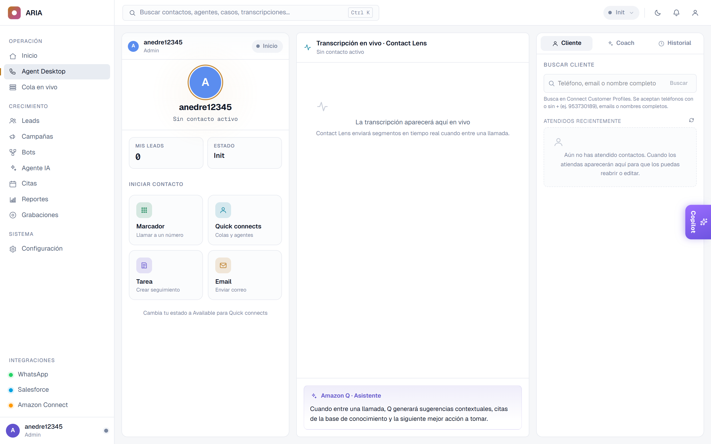
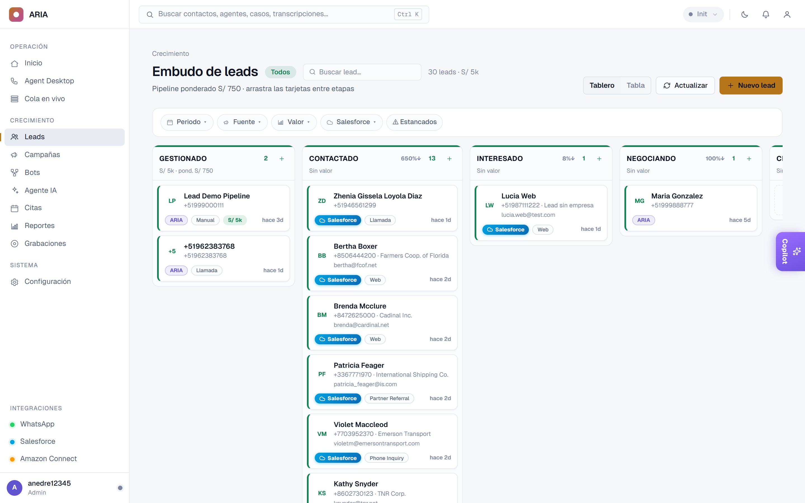
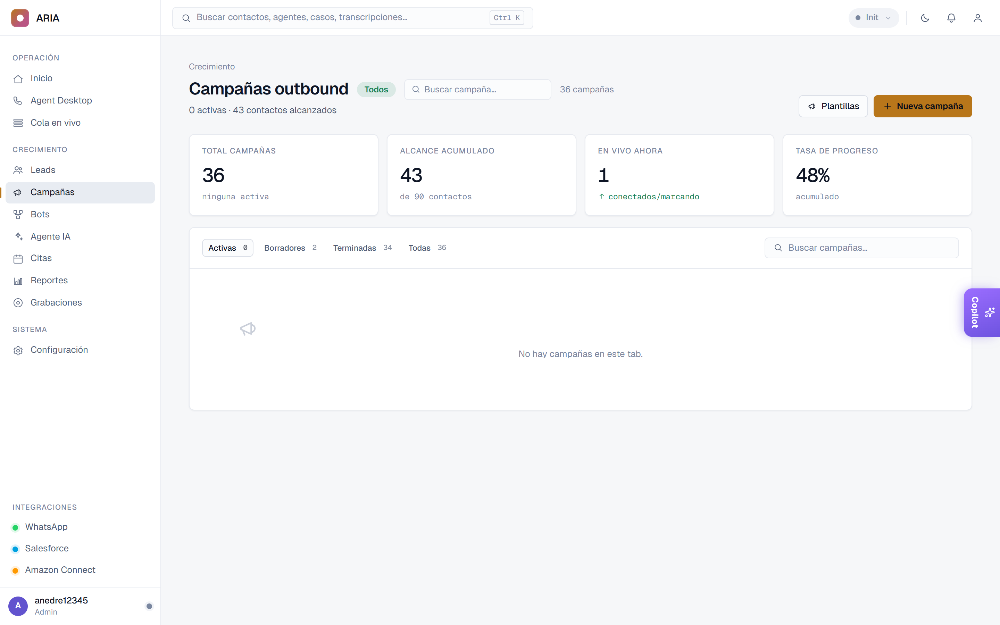
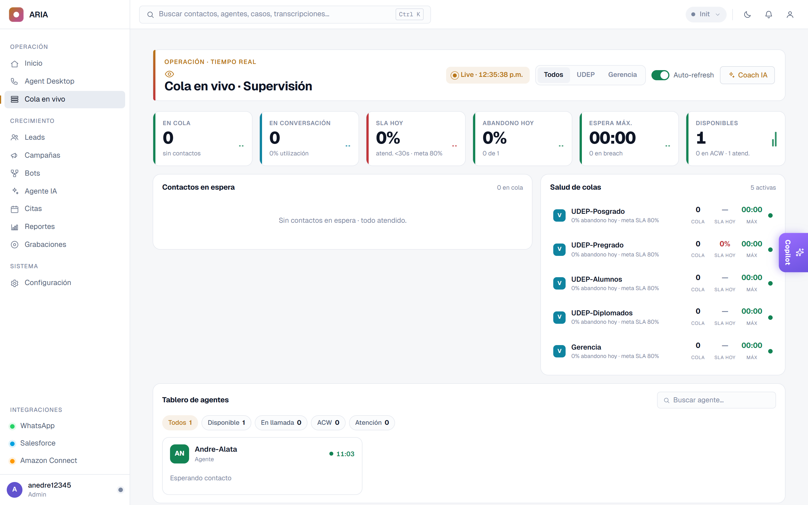
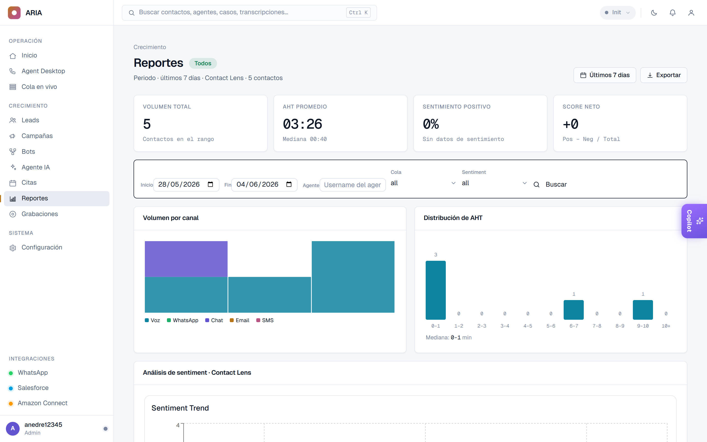
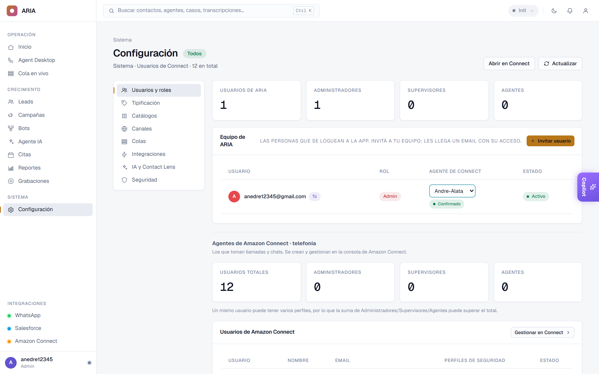

{width=6cm}

# Bienvenido a ARIA

**ARIA** es la plataforma donde tu equipo atiende a los clientes por **teléfono,
WhatsApp, chat y correo** — todo en un mismo lugar. Este manual te muestra, paso a
paso y sin tecnicismos, cómo empezar a usarla.

> **No se instala nada.** ARIA funciona en tu navegador (Chrome, Edge o Firefox).

\newpage

# 1. Crear tu cuenta

La primera vez, creás tu cuenta:

1. Entrá a ARIA y tocá la pestaña **"Crear cuenta"**.
2. Completá tu **nombre**, el **nombre de tu empresa**, tu **correo** y una **contraseña**.
3. Tocá **"Crear cuenta"**. ¡Listo!

{width=16cm}

\newpage

# 2. Iniciar sesión

Las próximas veces solo ingresás con tu **correo** y tu **contraseña**, y tocás
**"Iniciar sesión"**.

{width=16cm}

\newpage

# 3. La pantalla principal (Inicio)

Apenas entrás ves el **Inicio**: un resumen de tu operación — llamadas del día,
leads, citas y la actividad del equipo. A la **izquierda** está el menú para moverte
por toda la app.

{width=16cm}

\newpage

# 4. Atender clientes — Tu escritorio (para Agentes)

En **Agent Desktop** atendés cada contacto. Cuando entra una llamada o un mensaje,
lo aceptás y ves todo sobre el cliente: sus datos, su historial y la **transcripción
en vivo**. La inteligencia artificial te **sugiere respuestas** y te ayuda a resolver.

{width=16cm}

\newpage

# 5. Leads — tu embudo de ventas

En **Leads** ves a tus posibles clientes organizados por etapa (Contactado,
Interesado, Negociando…). Arrastrás cada tarjeta de una etapa a la siguiente a
medida que el cliente avanza.

{width=16cm}

\newpage

# 6. Campañas

En **Campañas** armás envíos masivos: subís tu lista de contactos y ARIA llama o
manda WhatsApp por vos, en orden. Mirás los resultados en vivo (contactados,
ventas, pendientes).

{width=16cm}

\newpage

# 7. Monitoreo en vivo (para Supervisores)

En **Cola en vivo** los supervisores ven la operación en tiempo real: quién está en
espera, cuánto demora la atención y qué agentes están disponibles.

{width=16cm}

\newpage

# 8. Reportes

En **Reportes** medís el desempeño: productividad por agente, sentimiento de los
clientes y conversión de tus campañas.

{width=16cm}

\newpage

# 9. Configuración (para Administradores)

En **Configuración** el administrador gestiona el **equipo** (invitar usuarios), las
**integraciones** (WhatsApp, Salesforce, Amazon Connect) y las reglas de la cuenta.

{width=16cm}

\newpage

# 10. Puesta en marcha (resumen para el administrador)

ARIA funciona en el navegador, así que **no hay nada que instalar**. Para dejar todo
listo, el administrador hace una sola vez:

1. **Conectar Amazon Connect** — un asistente guiado lo lleva paso a paso (toma unos
   3 minutos). No necesitás ser técnico.
2. **Invitar al equipo** — desde *Configuración → Equipo*. A cada persona le llega un
   correo con su acceso.
3. **¡A atender!** — tus datos viven en tu propia nube, bajo tu control.

---

## ¿Necesitás ayuda?

Escribinos a **[ tu correo de soporte aquí ]** y te damos una mano.

*ARIA · by Novasys — Junio 2026*
