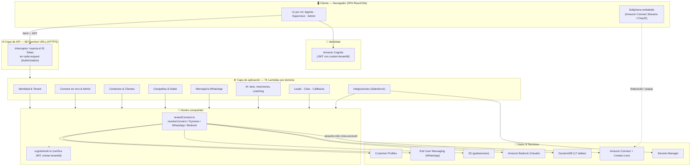
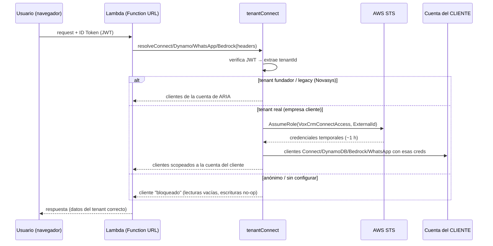

# Arquitectura de la Aplicación — ARIA (Connectview)

**Documento técnico** · v1.0 · 2026-06-04
Audiencia: evaluación técnica / académica.

---

## 1. Resumen del producto

**ARIA** (nombre interno *Connectview*) es una plataforma **SaaS multi-tenant**
de *contact center* y CRM construida sobre **Amazon Connect**. Reemplaza la
combinación típica de Kommo (CRM) + Chattigo (omnicanal) + Salesforce con una sola
aplicación que cubre: telefonía (softphone), WhatsApp, chat y correo; campañas de
salida (*outbound*); embudo de leads; bots / Agentes de IA; tipificación y
reportería; todo asistido por IA (resúmenes, copiloto, *coaching*).

Su rasgo arquitectónico distintivo es el modelo **BYO ("Bring Your Own")**: cada
empresa cliente (*tenant*) usa **sus propios recursos de AWS** —su instancia de
Amazon Connect, su número de WhatsApp, su Amazon Bedrock, sus tablas de datos— y
ARIA los opera mediante **asunción de rol entre cuentas** (*cross-account
assume-role*). La plataforma nunca toma posesión de las credenciales del cliente y
los datos del cliente pueden vivir 100 % en su propia cuenta.

### 1.1 Atributos de calidad priorizados

| Atributo | Cómo se logra |
|----------|---------------|
| **Aislamiento multi-tenant** | `tenantId` en el JWT de Cognito + assume-role con `ExternalId` por tenant; clientes "bloqueados" como *fail-safe*. |
| **Soberanía de datos** | BYO Data Plane: las 14 tablas de negocio y las grabaciones viven en la cuenta del cliente. |
| **Elasticidad / costo** | 100 % *serverless* (Lambda + DynamoDB on-demand): se paga por uso, escala a cero. |
| **Time-to-market** | Amplify Gen 2 + Function URLs: cada capacidad es una Lambda independiente, desplegable sola. |
| **Seguridad** | JWT verificado en cada Lambda (`aws-jwt-verify`); rol cross-account de mínimo privilegio y revocable. |

---

## 2. Stack tecnológico

> Verificado contra `package.json` y `amplify_outputs.json` del repositorio.

### Frontend (SPA)
- **React 19.2** + **TypeScript 6** + **Vite 8** (bundler / dev server).
- **AWS Amplify UI** (`@aws-amplify/ui-react`) como capa de autenticación.
- **amazon-connect-streams 2.25** + **amazon-connect-chatjs 5** (softphone CCP).
- **@xyflow/react** (constructor visual de bots), **ECharts** + **Recharts**
  (dashboards), **framer-motion** (animación), **react-router 7** (ruteo).
- **Tailwind CSS 4**, **libphonenumber-js** (teléfonos), **papaparse** (CSV).

### Backend (serverless)
- **AWS Amplify Gen 2** (definición de backend como código, CDK por debajo).
- **76 funciones AWS Lambda** (Node.js 20, handlers en TypeScript / esbuild).
- Expuestas como **68 Function URLs** HTTP (auth `NONE` + verificación JWT propia).
- **17 tablas Amazon DynamoDB** (`connectview-*`).
- **Amazon Cognito** (identidad, *user pool* `us-east-1_csLvANyZo`).
- **Amazon Bedrock** (LLM Claude), **Amazon Connect** + **Contact Lens**,
  **Customer Profiles**, **AWS End User Messaging Social** (WhatsApp),
  **Amazon S3** (grabaciones), **AWS Secrets Manager**, **AWS STS**.

---

## 3. Vista de capas (lógica)

**Lectura de la vista:** el navegador autentica al usuario contra **Cognito** (capa
de identidad de ARIA) y, por separado, levanta el **softphone** de Amazon Connect.
Toda llamada de datos pasa por un **interceptor** que adjunta el *ID Token*; las
**Function URLs** entran a las Lambdas, que delegan en el **núcleo compartido**
(`tenantConnect`) la resolución del tenant y la obtención de clientes de AWS
*scopeados* a la cuenta correcta.

---

## 4. Componentes lógicos

### 4.1 Frontend — funcionalidad por rol

La app define **3 roles** (grupos de Cognito): `Agents`, `Supervisors`, `Admins`,
con jerarquía `Agente (0) < Supervisor (1) < Admin (2)` y *fail-closed* (sin grupo
válido → Agente). Sobre eso hay un control de capacidades granular editable
(matriz `capacidad → rol mínimo`).

| Módulo | Agente | Supervisor | Admin |
|--------|:------:|:----------:|:-----:|
| Workspace del agente (softphone, omnicanal, wrap-up, copiloto IA) | ✅ | ✅ + monitor/barge/whisper | ✅ + transferir/cortar |
| Campañas (outbound voz/WhatsApp/email) | ver asignadas | crear/editar/controlar | CRUD total + asignar agentes |
| Leads (embudo) | mover etapas | importar/sync | bulk + config de origen |
| Monitoreo de colas (WFM) | — | ✅ | ✅ + gestión de agentes |
| Reportes | — | ✅ | ✅ + auditoría |
| Constructor de bots / Agente IA | probar | crear/editar | publicar |
| Panel Admin (integraciones, equipo, taxonomía, permisos) | — | — | ✅ |

### 4.2 Backend — dominios funcionales (76 Lambdas)

> Agrupación de las 76 funciones (`amplify/functions/*/handler.ts`). El listado
> exhaustivo está en el [runbook interno](../interno/runbook.md).

| Dominio | # | Ejemplos representativos |
|---------|:-:|--------------------------|
| **Identidad & Tenant** | 9 | `provision-tenant`, `invite-user`, `list-team`, `manage-permissions`, `manage-connections`, `get-federation-token`, `verify-connect-connection`, `diagnose-connection` |
| **Connect en vivo & Admin** | 15 | `get-realtime-metrics`, `get-live-queue`, `list-queues`, `list-users`, `admin-monitor-contact`, `admin-transfer-contact`, `admin-stop-contact`, `admin-change-agent-status`, `admin-list-audit` |
| **Contactos & Clientes** | 13 | `get-contact-detail`, `get-contact-history`, `get-live-transcript`, `get-recording`, `get-customer-thread`, `lookup-customer-profile`, `update-customer-profile`, `save-agent-notes` |
| **Campañas & Dialer** | 13 | `create-campaign`, `control-campaign`, `campaign-dialer`, `assign-campaign-agents`, `get-campaign-stats`, `clone-campaign`, `relaunch-campaign`, `start-outbound-contact` |
| **Mensajería WhatsApp** | 4 | `send-whatsapp-template`, `list-whatsapp-templates`, `get-hsm-report`, `agent-channel-adapter` |
| **IA & Analítica** | 8 | `bot-runtime`, `manage-bot`, `generate-call-summary`, `get-q-suggestions`, `get-agent-leaderboard`, `get-agent-wellness`, `get-churn-risk`, `enrich-contact-lens` |
| **Leads · Citas · Callbacks** | 6 | `manage-leads`, `manage-appointment`, `schedule-callback`, `list-callbacks`, `callback-dispatcher`, `web-form-capture` |
| **Salesforce & Eventos** | 5 | `salesforce-sync`, `salesforce-inbound-webhook`, `salesforce-oauth-start`, `salesforce-oauth-callback`, `process-contact-event` |
| **Configuración** | 3 | `manage-taxonomy`, `manage-catalog`, `get-flow-queues` |

### 4.3 Núcleo compartido (`amplify/functions/_shared/`)

| Módulo | Responsabilidad |
|--------|-----------------|
| `tenantConnect.ts` | Resuelve el tenant del request y devuelve clientes de AWS (Connect, DynamoDB, S3, Customer Profiles, WhatsApp, Bedrock) con credenciales **asumidas** de la cuenta del cliente. Cachea las credenciales ~50 min. |
| `cognitoAuth.ts` | Verifica la firma del JWT (`aws-jwt-verify`) y extrae `tenantId`. |
| `salesforceClient.ts` / `tenantSalesforce.ts` | Cliente REST/SOQL de Salesforce con tokens OAuth **por tenant**. |
| `leadSync.ts` | Propagación de leads: DynamoDB → Customer Profiles → Salesforce. |

---

## 5. Modelo de datos (DynamoDB)

17 tablas. Se dividen en **metadata del SaaS** (siempre en la cuenta de ARIA) y
**datos de negocio** (pooled en ARIA para el tenant fundador, o en la cuenta del
cliente con BYO Data Plane).

### Metadata del SaaS (cuenta ARIA, nunca migra)
| Tabla | PK | Propósito |
|-------|----|-----------|
| `connectview-tenants` | `tenantId` | Organizaciones (nombre, plan). |
| `connectview-connections` | `tenantId` | Config de integraciones (ARN de Connect, rol, ExternalId, Salesforce, WhatsApp, flag de Data Plane). |
| `connectview-permissions` | `tenantId` | Matriz RBAC (capacidad → rol mínimo). |

### Datos de negocio (pooled en ARIA **o** BYO en la cuenta del cliente)
| Tabla | Propósito |
|-------|-----------|
| `connectview-campaigns` | Campañas (voz / WhatsApp / email). |
| `connectview-campaign-contacts` | Destinatarios + resultado de cada campaña. |
| `connectview-campaign-agents` | Asignación agente ↔ campaña. |
| `connectview-contacts` | Registros de contacto (event-sourced desde Connect). |
| `connectview-leads` | Embudo de leads. |
| `connectview-callbacks` | Devoluciones de llamada programadas. |
| `connectview-appointments` | Agenda de citas. |
| `connectview-wrapup-history` | Historial *append-only* de tipificaciones. |
| `connectview-ai-conversations` | Logs de conversaciones de bots / coach. |
| `connectview-bots` | Definiciones de flujos de bot (nodos + aristas). |
| `connectview-taxonomies` | Árbol de tipificación (etapas + sub-etapas). |
| `connectview-catalogs` | Catálogos / tablas de lookup personalizadas. |
| `connectview-hsm-sends` | Log de envíos de plantillas WhatsApp + estado. |
| `connectview-admin-audit` | Bitácora de acciones administrativas (auditoría). |

---

## 6. Modelo multi-tenant BYO (clave de la arquitectura)

**Qué corre en cada cuenta:**

| En la cuenta de **ARIA** (731736972577) | En la cuenta del **Cliente** (BYO) |
|----------------------------------------|------------------------------------|
| Cómputo: las 76 Lambdas + Function URLs | Instancia de Amazon Connect (telefonía, colas, flujos) |
| Identidad: Cognito | Amazon Bedrock (tokens de los bots/resúmenes) |
| Metadata: `connections`, `tenants`, `permissions` | 14 tablas DynamoDB de negocio (BYO Data Plane) |
| Secrets Manager (tokens OAuth por tenant) | S3 de grabaciones |
| Orquestación (dialer, dispatcher) | End User Messaging (número WhatsApp) · Customer Profiles |

> Esta división es deliberada: el **cómputo** (barato, sin datos sensibles) lo
> centraliza ARIA; el **dato y el uso facturable** (telefonía, IA, mensajería,
> almacenamiento) quedan en la cuenta del cliente. Ver el detalle económico en
> [05-costos.md](05-costos.md).

### 6.1 Defensa en profundidad
- **JWT obligatorio**: cada Lambda verifica firma + extrae `tenantId`; sin token
  válido → cliente *bloqueado* (no se filtran datos del tenant fundador).
- **`ExternalId` por tenant**: el rol del cliente (`VoxCrmConnectAccess`) solo
  confía en la cuenta de ARIA **y** exige el `ExternalId` correcto (anti
  *confused-deputy*).
- **Mínimo privilegio**: el rol da solo lo necesario (lectura de métricas,
  outbound *scopeado* a la instancia, S3 del bucket de grabaciones, Bedrock
  `InvokeModel`, WhatsApp `SendWhatsAppMessage`).
- **Revocable**: el cliente borra el *stack* de CloudFormation y corta el acceso.

---

## 7. Integraciones externas

| Integración | Mecanismo | Por tenant |
|-------------|-----------|:----------:|
| **Amazon Connect** | Streams (softphone) + assume-role (server-side) | ✅ |
| **WhatsApp** | AWS End User Messaging Social (Meta WABA del cliente) | ✅ |
| **Amazon Bedrock** | `InvokeModel` con credenciales asumidas | ✅ |
| **Salesforce** | OAuth web (App conectada compartida) + refresh token por tenant en Secrets Manager | ✅ |
| **Webhooks / formularios web** | `web-form-capture` (Function URL pública) → lead + Customer Profile | ✅ |

---

## 8. Decisiones de diseño y trade-offs

1. **Function URLs en vez de API Gateway.** Menor costo y latencia, despliegue por
   función. *Trade-off*: la autorización se implementa en el handler (JWT propio)
   en lugar de delegarla a un *authorizer* gestionado.
2. **Mutable *module var* para clientes por request** (patrón `let dynamo`/`let
   bedrock` reasignado por invocación). Aprovecha que Lambda procesa un evento por
   contenedor; evita re-instanciar clientes y round-trips a STS.
3. **Pooled → BYO opt-in.** El tenant arranca con datos *pooled* y migra a su
   propio *data plane* cuando aplica el template de CloudFormation. *Trade-off*:
   código que soporta ambos caminos (con *fallback* seguro).
4. **Serverless puro (sin VPC).** Simplicidad y escalado a cero. La seguridad se
   apoya en IAM + JWT, no en aislamiento de red.

---

## 9. Referencias

- Arquitectura física (recursos AWS y despliegue): [02-arquitectura-fisica.md](02-arquitectura-fisica.md)
- Flujos de proceso: [03-flujo-procesos.md](03-flujo-procesos.md)
- Núcleo BYO: `amplify/functions/_shared/tenantConnect.ts`
