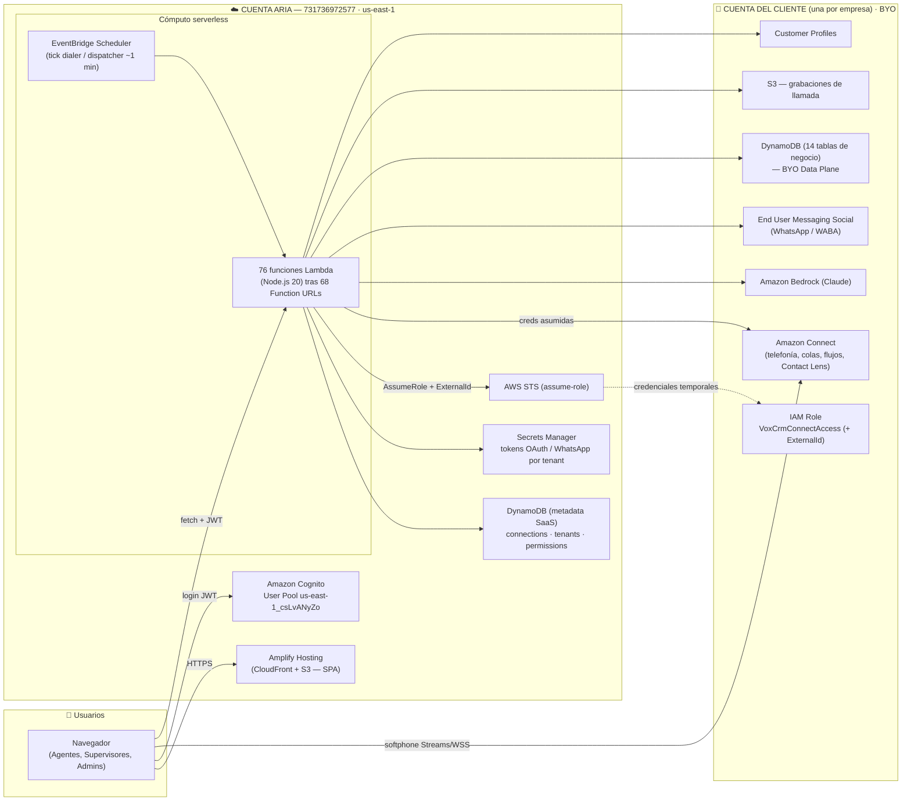
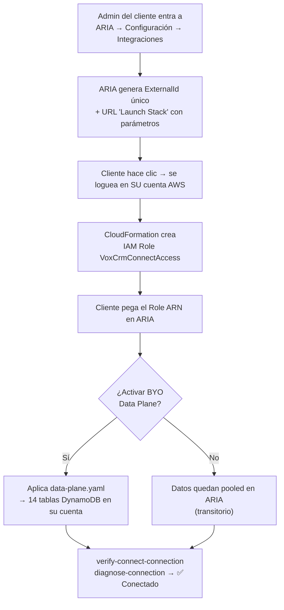

# Arquitectura Física (Despliegue AWS) — ARIA (Connectview)

**Documento técnico** · v1.0 · 2026-06-04

Describe **dónde vive cada cosa**: los servicios físicos de AWS, en qué cuenta y
región, cómo se conectan y cómo escalan. Complementa la
[arquitectura de la aplicación](01-arquitectura-aplicacion.md) (vista lógica).

---

## 1. Topología general

La plataforma es **100 % serverless** y se reparte en **dos clases de cuenta AWS**:

- **Cuenta de la plataforma (ARIA / Novasys)** — `731736972577`, región `us-east-1`.
  Aloja el cómputo, la identidad y la metadata del SaaS. Es **una sola** para todos
  los tenants.
- **Cuenta del cliente (tenant, BYO)** — **una por empresa**. Aloja la instancia de
  Amazon Connect, Bedrock, WhatsApp, el almacenamiento de grabaciones y —
  opcionalmente— las tablas de datos de negocio.



---

## 2. Inventario de recursos por cuenta

### 2.1 Cuenta de la plataforma (ARIA)

| Recurso AWS | Identificador / detalle | Función |
|-------------|-------------------------|---------|
| **Amplify Hosting** | CloudFront + S3 | Sirve la SPA (build de Vite) globalmente vía CDN. |
| **Amazon Cognito** | User Pool `us-east-1_csLvANyZo`, client `6qfs8onjto75i9cckl1vns80f9` | Identidad de ARIA; grupos `Agents`/`Supervisors`/`Admins`; atributo `custom:tenantId`. |
| **AWS Lambda** | 76 funciones Node.js 20 | Toda la lógica de negocio. |
| **Function URLs** | 68 endpoints HTTPS (auth `NONE`) | Exposición HTTP de las Lambdas; CORS abierto + verificación JWT en el handler. |
| **Amazon DynamoDB** | `connectview-connections`, `-tenants`, `-permissions` | Metadata del SaaS (config de tenants, RBAC). On-demand. |
| **AWS Secrets Manager** | `connectview/tenant/<id>/*`, `connectview/salesforce` | Tokens OAuth (Salesforce), credenciales WhatsApp. |
| **AWS STS** | — | Emite credenciales temporales para entrar a la cuenta del cliente. |
| **EventBridge Scheduler** | reglas tipo *cron* | Dispara `campaign-dialer` y `callback-dispatcher` (~1 min). |
| **Amazon S3** | `vox-cfn-templates-731736972577` | Hospeda los templates de CloudFormation del *onboarding* 1-clic. |
| **CloudWatch** | Log Groups por Lambda | Logs y métricas. |
| **IAM** | `connectview-campaign-lambda-role`, `connectview-admin-lambda-role`, etc. | Roles de ejecución de las Lambdas (incluye `sts:AssumeRole` sobre `VoxCrmConnectAccess`). |

### 2.2 Cuenta del cliente (tenant, BYO)

| Recurso AWS | Creado por | Función |
|-------------|-----------|---------|
| **IAM Role `VoxCrmConnectAccess`** | Template CloudFormation `connect-role.yaml` (1-clic) | Confía solo en la cuenta de ARIA + `ExternalId`. Da permisos *scopeados*: Connect (lectura + outbound), S3 (grabaciones), Bedrock (`InvokeModel`), WhatsApp (`SendWhatsAppMessage`). |
| **Amazon Connect** | El cliente (su instancia) | Telefonía, colas, perfiles de enrutamiento, flujos, Contact Lens. |
| **Amazon Bedrock** | El cliente (su cuenta) | LLM Claude para bots, resúmenes, copiloto (su quota / su factura de tokens). |
| **End User Messaging Social** | El cliente | Envío/recepción de WhatsApp desde el número del cliente. |
| **DynamoDB (14 tablas)** | Template `data-plane.yaml` (opcional) | Datos de negocio en la cuenta del cliente (soberanía). `DeletionPolicy: Retain`. |
| **Amazon S3** | El cliente (bucket de Connect) | Grabaciones de llamadas. ARIA genera URLs prefirmadas con las creds asumidas. |
| **Customer Profiles** | El cliente (dominio de Connect) | Vista 360 del cliente final. |

---

## 3. Onboarding físico de un tenant (CloudFormation 1-clic)

El alta de una empresa **no requiere intervención de ARIA en la cuenta del cliente**:
el cliente aplica plantillas de CloudFormation en SU cuenta, que crean el rol y
(opcionalmente) las tablas.



Plantillas (hospedadas en S3 público de ARIA, sin secretos — el `ExternalId` viaja
como parámetro del *quick-create*, no dentro del template):

- `connect-role.yaml` — rol cross-account (obligatorio). Políticas:
  `VoxCrmConnectReadOnly`, `VoxCrmConnectOutbound`, `VoxCrmRecordingAccess`,
  `VoxCrmDiagnostics`, `VoxCrmWhatsApp`, `VoxCrmBedrock`.
- `data-plane.yaml` — 14 tablas DynamoDB + permisos (opcional, recomendado).
- `data-plane-permissions.yaml` — solo permisos, idempotente (si las tablas ya
  existen).

---

## 4. Red, seguridad y comunicaciones

- **Sin VPC.** Todo es *serverless* gestionado; no hay subredes, NAT ni instancias
  EC2 que endurecer. La superficie es IAM + JWT.
- **Tráfico de datos:** el navegador habla HTTPS contra las Function URLs (TLS de
  AWS) y WSS contra Amazon Connect (softphone). Toda request lleva el *ID Token* en
  `Authorization`.
- **Cross-account:** ARIA → cliente es siempre `sts:AssumeRole` con `ExternalId`;
  nunca se almacenan credenciales del cliente (las temporales se cachean ~50 min en
  memoria del contenedor Lambda).
- **Secretos:** los tokens OAuth de Salesforce y de WhatsApp viven cifrados en
  Secrets Manager bajo prefijos por tenant.
- **CORS:** configurado a nivel de Function URL; la autorización real es el JWT.

---

## 5. Escalabilidad, disponibilidad y operación

| Dimensión | Característica |
|-----------|---------------|
| **Escalado** | Lambda escala por concurrencia automáticamente; DynamoDB on-demand absorbe picos sin aprovisionar. Escala a **cero** en reposo. |
| **Multi-tenant** | Aislamiento por cuenta (BYO) + por `tenantId`; el cómputo es compartido, el dato no. |
| **Disponibilidad** | Servicios *managed* de AWS, multi-AZ por defecto (Lambda, DynamoDB, Cognito, S3). |
| **Región** | Base `us-east-1`. Bedrock usa perfiles de inferencia *cross-region* (`us.anthropic.*`). El cliente puede fijar otra región de Bedrock en su config. |
| **Despliegue** | Lambdas hand-managed: `node scripts/deploy-lambda.mjs <dir>` (bundle esbuild → `update-function-code`). Frontend: `vite build` → Amplify Hosting. Ver [runbook](../interno/runbook.md). |
| **Observabilidad** | CloudWatch Logs por función; panel "Estado de la integración" del cliente lee sus propios eventos de CloudFormation vía el rol. |
| **Recuperación** | Tablas BYO con `DeletionPolicy: Retain` (re-aplicar el stack nunca borra datos). |

---

## 6. Diagrama de despliegue resumido (texto)

```
Internet
  │  HTTPS
  ├──────────────► Amplify Hosting (CloudFront/S3) ──► SPA React
  │
Navegador ──JWT──► Function URLs (68) ──► Lambda (76) ──┬─► DynamoDB metadata (ARIA)
  │                                                      ├─► Secrets Manager (ARIA)
  │  WSS (softphone)                                     └─► STS ─AssumeRole(ExternalId)─┐
  └──────────────► Amazon Connect (cuenta CLIENTE) ◄───────────────────────────────────┘
                        ▲   │
                        │   └─► Contact Lens · S3 grabaciones · Customer Profiles
                        └─────  Bedrock · End User Messaging (WhatsApp) · DynamoDB BYO
```

---

## 7. Referencias

- Vista lógica / componentes: [01-arquitectura-aplicacion.md](01-arquitectura-aplicacion.md)
- Procesos paso a paso: [03-flujo-procesos.md](03-flujo-procesos.md)
- Costos por cuenta (ARIA vs cliente): [05-costos.md](05-costos.md)
- Plantillas reales: `infra/cfn/connect-role.yaml`, `src/components/admin/cfnTemplates.ts`
