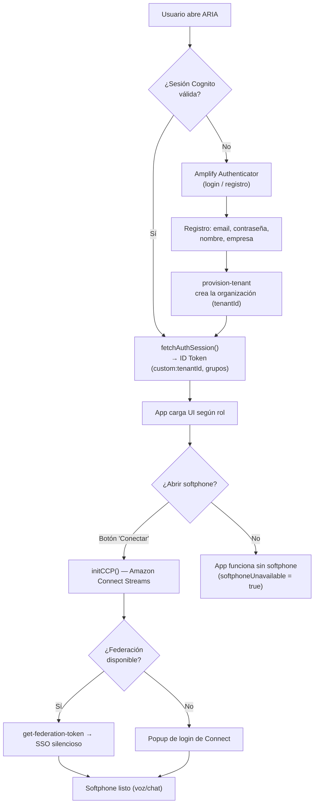
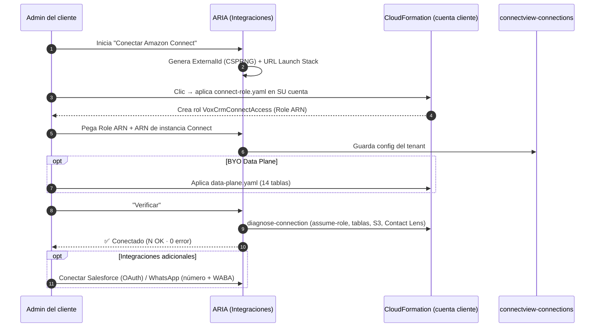
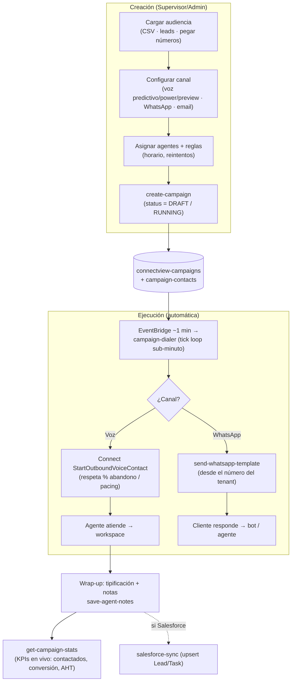
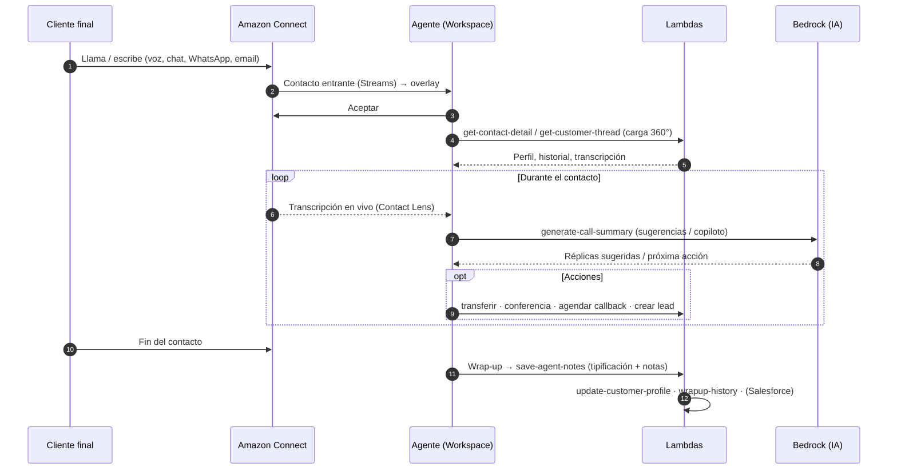
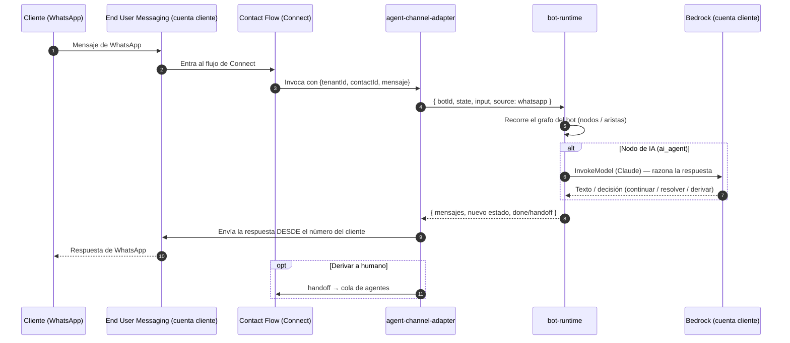
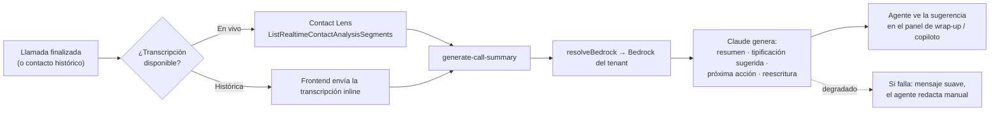

# Diagrama de Flujo de Procesos — ARIA (Connectview)

**Documento técnico** · v1.0 · 2026-06-04

Procesos de negocio clave de la plataforma, en notación de flujo / secuencia. Cada
proceso indica los componentes (frontend, Lambdas, servicios AWS) que intervienen.

Índice:
1. [Autenticación e identidad](#1-autenticación-e-identidad)
2. [Onboarding de un tenant (BYO)](#2-onboarding-de-un-tenant-byo)
3. [Campaña de salida (outbound)](#3-campaña-de-salida-outbound)
4. [Atención de un contacto entrante](#4-atención-de-un-contacto-entrante-agente)
5. [Bot de WhatsApp entrante](#5-bot-de-whatsapp-entrante)
6. [Resumen de llamada con IA](#6-resumen-de-llamada-con-ia)

---

## 1. Autenticación e identidad

Dos capas independientes: **identidad de ARIA** (Cognito, obligatoria) y
**softphone de Amazon Connect** (opcional; si falla, la app sigue sin voz).

**Componentes:** `VoxAuthContext`, `ConnectAuthContext`, `CCPContext`,
`src/lib/connect.ts`; Lambdas `provision-tenant`, `get-federation-token`,
`set-connect-link`.

---

## 2. Onboarding de un tenant (BYO)

Una empresa nueva conecta **sus** recursos sin que ARIA toque su cuenta. Ver también
el diagrama de despliegue en [02-arquitectura-fisica.md](02-arquitectura-fisica.md#3-onboarding-físico-de-un-tenant-cloudformation-1-clic).

**Componentes:** `IntegrationsManager`, `ConnectSetupWizard`, `cfnTemplates.ts`;
Lambdas `manage-connections`, `verify-connect-connection`, `diagnose-connection`,
`salesforce-oauth-start/callback`.

---

## 3. Campaña de salida (outbound)

**Componentes:** `CampaignCreatePage`, `CampaignDetailPage`; Lambdas
`create-campaign`, `control-campaign`, `campaign-dialer`, `assign-campaign-agents`,
`get-campaign-stats`, `send-whatsapp-template`, `save-agent-notes`.

---

## 4. Atención de un contacto entrante (agente)

**Componentes:** `AgentDesktopPage` + paneles (perfil, historial, transcripción,
copiloto, coach); Lambdas `get-contact-detail`, `get-live-transcript`,
`generate-call-summary`, `get-q-suggestions`, `save-agent-notes`,
`update-customer-profile`, `schedule-callback`.

---

## 5. Bot de WhatsApp entrante

El bot **razona** con el Bedrock del cliente y **responde** desde el número del
cliente (BYO de punta a punta).

**Componentes:** Lambdas `agent-channel-adapter`, `bot-runtime`,
`send-whatsapp-template`; tablas `connectview-bots`, `connectview-ai-conversations`;
núcleo `resolveBedrock` / `resolveWhatsApp` de `tenantConnect`.

---

## 6. Resumen de llamada con IA

**Componentes:** Lambda `generate-call-summary` (modos: `summary`, `wrap-up-suggest`,
`next-action`, `suggest-replies`, `rewrite`, `assistant`); Bedrock por tenant.

---

## 7. Referencias

- Componentes lógicos: [01-arquitectura-aplicacion.md](01-arquitectura-aplicacion.md)
- Recursos físicos: [02-arquitectura-fisica.md](02-arquitectura-fisica.md)
- Manual de uso por rol: [04-manual-usuario-instalacion.md](04-manual-usuario-instalacion.md)
