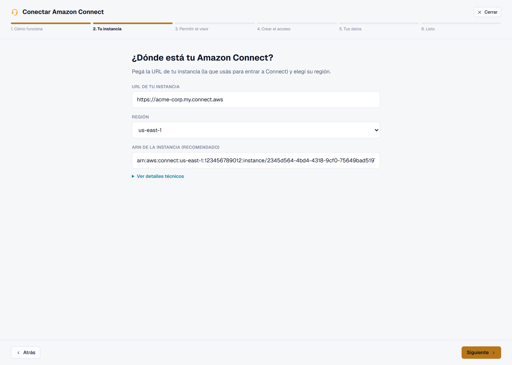
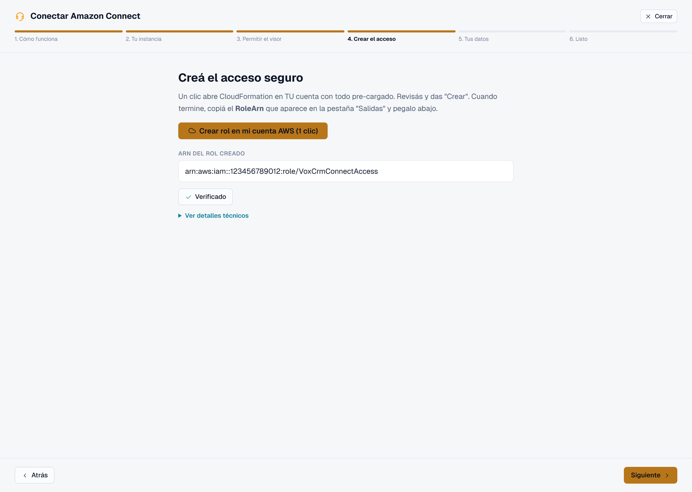
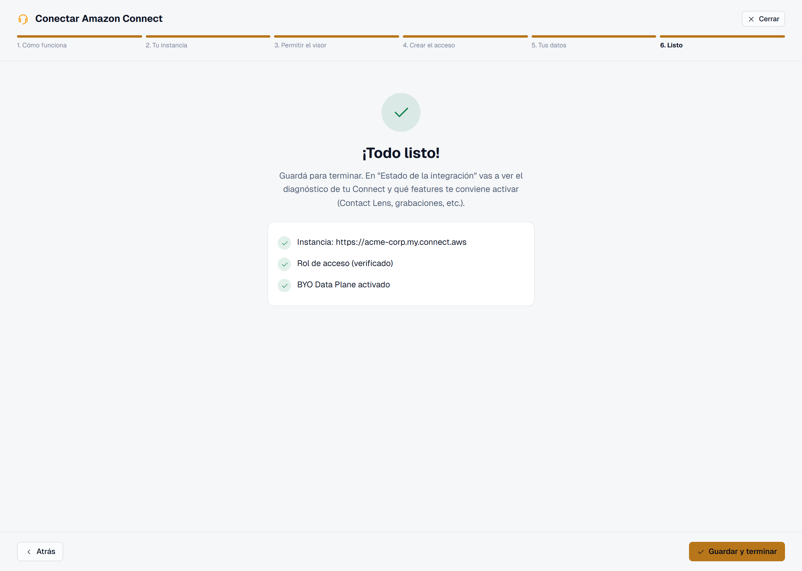

# Manual de Usuario e Instalación — ARIA (Connectview)

**Documento técnico** · v1.0 · 2026-06-04

Dos partes:
- **Parte A — Instalación y despliegue** (para quien levanta o publica la app).
- **Parte B — Manual de usuario** (para Agentes, Supervisores y Admins).

---

# Parte A · Instalación y despliegue

## A.1 Requisitos previos

| Requisito | Detalle |
|-----------|---------|
| **Node.js** | v20 o superior (runtime de las Lambdas y del frontend). |
| **npm** | Incluido con Node. |
| **Cuenta AWS** | Con AWS CLI configurado (`aws configure`) y permisos sobre la cuenta de la plataforma. |
| **Instancia Amazon Connect** | Para el tenant (la del cliente en producción; una de prueba en dev). |
| **Navegador** | Chrome/Edge/Firefox recientes (el softphone usa WebRTC). |

## A.2 Puesta en marcha en desarrollo

```bash
# 1. Clonar e instalar dependencias
git clone <repo> && cd Connectview
npm install

# 2. Configuración del backend
#    amplify_outputs.json ya contiene el User Pool de Cognito, los grupos y
#    los 68 endpoints (custom.apiEndpoints). No se versiona ningún secreto.

# 3. Levantar el servidor de desarrollo
npm run dev
#    → http://localhost:5173
```

> **Importante (softphone):** el iframe de Amazon Connect exige que el origen esté
> en *Approved Origins* de la instancia. Para dev, agregar `http://localhost:5173`.
> Vite está fijado a ese puerto (`strictPort`) por esta razón.

## A.3 Scripts del proyecto

| Comando | Acción |
|---------|--------|
| `npm run dev` | Servidor de desarrollo (Vite, puerto 5173). |
| `npm run build` | Build de producción → `dist/`. |
| `npm run typecheck` | Validación de tipos (`tsc -b`). |
| `npm run lint` | ESLint. |
| `npm run preview` | Previsualiza el build local. |

## A.4 Despliegue de funciones Lambda (backend)

Las Lambdas son *hand-managed* (no se redepliegan con `ampx`). Convención:
`amplify/functions/<dir>/handler.ts` → función `connectview-<dir>`.

```bash
# Desplegar una o varias funciones (bundle esbuild → update-function-code)
node scripts/deploy-lambda.mjs <dir> [<dir2> ...]

# Funciones con nombre largo amplify-managed:
node scripts/deploy-lambda.mjs <dir>=<nombre-largo-de-la-funcion>

# Crear una función nueva (+ Function URL + permisos públicos):
node scripts/create-lambda.mjs <dir> [KEY=VAL ...]
```

Verificación recomendada antes de desplegar: `npx tsc --noEmit` (todo el proyecto).
Detalle operativo en el [runbook interno](../interno/runbook.md).

## A.5 Despliegue del frontend

```bash
npm run build           # genera dist/
# Publicar dist/ en Amplify Hosting (CloudFront + S3)
```

## A.6 Alta de un cliente (tenant) — resumen

El cliente realiza el *onboarding* desde la propia app (no requiere acceso de ARIA a
su cuenta). Pasos (detalle en [03-flujo-procesos.md §2](03-flujo-procesos.md#2-onboarding-de-un-tenant-byo)):

1. Registrarse en ARIA (email, contraseña, **nombre de empresa**).
2. **Configuración → Integraciones → Conectar Amazon Connect**: aplicar el template
   de CloudFormation 1-clic (crea el rol `VoxCrmConnectAccess`), pegar el Role ARN y
   el ARN de la instancia.
3. (Recomendado) Activar **BYO Data Plane** (aplica `data-plane.yaml`, 14 tablas).
4. (Opcional) Conectar **Salesforce** (OAuth) y **WhatsApp** (número + WABA).
5. **Verificar** → el diagnóstico confirma acceso (rol, instancia, tablas, S3,
   Contact Lens).
6. **Equipo**: invitar a los usuarios de la empresa y vincularlos a sus agentes de
   Connect.

## A.7 El asistente de conexión, paso a paso

El **asistente "Conectar Amazon Connect"** guía al administrador en 6 pantallas.
Se abre desde **Configuración → Integraciones → Conectar Amazon Connect**.

### Paso 1 — Cómo funciona
Explica, en lenguaje simple, **qué accede ARIA** (métricas, grabaciones, llamadas
salientes) y **qué nunca hace** (no guarda credenciales, no modifica tu Connect). El
acceso es revocable en cualquier momento.


### Paso 2 — Tu instancia
Se pega la **URL de la instancia** de Amazon Connect, se elige la **región** y
(recomendado) se pega el **ARN de la instancia** —con él, ARIA restringe las acciones
sensibles solo a esa instancia—.



### Paso 3 — Permitir el visor
Para que el softphone funcione embebido, se agrega el **dominio de ARIA** en
*Connect → Configuración de la aplicación → Orígenes aprobados*. (Opcional: si se
omite, todo funciona salvo el softphone embebido.)


### Paso 4 — Crear el acceso
Un clic abre **CloudFormation** en la cuenta del cliente con todo pre-cargado; al
terminar, se pega el **Role ARN** y se pulsa **Verificar conexión**. Detrás está el
`ExternalId` anti-suplantación.



### Paso 5 — Tus datos (BYO Data Plane)
Se crean con un clic las **14 tablas** en la cuenta del cliente (los datos viven en
SU cuenta) y se **verifican**. Las tablas tienen protección anti-borrado.


### Paso 6 — Listo
Resumen de lo configurado (instancia, rol verificado, Data Plane) y **Guardar para
terminar**. Después, "Estado de la integración" muestra el diagnóstico completo.



> Las capturas se generan con `node scripts/shoot-wizard.mjs` (ruta de diseño
> `/wizard-demo`, solo en desarrollo).

---

# Parte B · Manual de usuario

La interfaz se adapta al **rol** del usuario (Agente, Supervisor, Admin). Lo que no
corresponde al rol no aparece en el menú.

## B.1 Conceptos básicos

- **Identidad ARIA:** tu cuenta de acceso (email + contraseña), gestionada por el
  Admin de tu empresa.
- **Softphone:** el teléfono dentro del navegador. Se activa con el botón
  **"Conectar"**; puede pedirte iniciar sesión en Amazon Connect la primera vez.
- **Tipificación:** la categoría con que cierras cada contacto (definida por tu
  empresa en la taxonomía).

## B.2 Agente

**Objetivo:** atender contactos (voz, chat, WhatsApp, email) con apoyo de IA.

1. **Ingresar:** inicia sesión → pulsa **"Conectar"** para activar el softphone →
   ponte en estado **Disponible**.
2. **Atender un contacto:** al entrar uno, aparece un aviso → **Aceptar**. Se abre
   el *workspace* con:
   - Controles de llamada (silenciar, retener, transferir, conferencia, teclado).
   - **360° del cliente**: perfil, historial de interacciones, transcripción en vivo.
   - **Copiloto IA**: respuestas sugeridas y próxima mejor acción.
3. **Acciones útiles durante el contacto:** transferir a cola, agendar una
   **devolución de llamada**, **crear un lead**, tomar notas rápidas.
4. **Cierre (wrap-up):** elige la **tipificación**, agrega notas y guarda. La IA
   puede **sugerir** la tipificación y un resumen.
5. **Campañas:** si estás asignado a una campaña, verás tus contactos a llamar y las
   plantillas de WhatsApp disponibles.

## B.3 Supervisor

**Objetivo:** monitorear la operación en vivo y medir desempeño.

- **Monitoreo de colas (WFM):** contactos en espera, SLA, tiempos (AHT/ACW),
  agentes disponibles. Permite **escucha silenciosa**, **susurro** (*whisper*) y
  **barge** sobre una llamada activa.
- **Campañas:** crear, editar, pausar/reanudar, relanzar y clonar campañas; asignar
  agentes.
- **Reportes:** desempeño por agente (AHT, conversión), por contacto (canal,
  sentimiento), **riesgo de churn** y reporte de envíos de WhatsApp (HSM).
- **Grabaciones / Lead 360:** búsqueda de un cliente y vista unificada de llamadas,
  WhatsApp, emails y archivos.

## B.4 Administrador

**Objetivo:** configurar la cuenta de la empresa e integraciones.

- **Equipo:** invitar usuarios (email + nombre + rol), ver su estado y **vincular**
  cada usuario ARIA con su agente de Amazon Connect (el agente confirma con sus
  credenciales).
- **Integraciones:** conectar/verificar Amazon Connect (rol cross-account),
  Salesforce (OAuth) y WhatsApp (número + WABA); activar el **BYO Data Plane**.
- **Taxonomía:** definir el árbol de tipificaciones (etapas y sub-etapas) que ven
  los agentes en el wrap-up y el embudo de leads.
- **Catálogos:** tablas de lookup personalizadas.
- **Permisos:** ajustar qué rol mínimo requiere cada capacidad (sin re-desplegar).
- **Auditoría:** bitácora de acciones administrativas.

## B.5 Constructor de bots / Agente IA

Disponible para los roles habilitados. Permite diseñar un bot conversacional en un
**lienzo visual** (arrastrar nodos: mensaje, pregunta, condición, plantilla, IA,
derivar a humano, etc.), **probarlo** en un simulador y guardarlo. En producción, el
bot atiende WhatsApp/chat y, cuando corresponde, **deriva a un agente**.

## B.6 Resolución de problemas frecuente

| Síntoma | Causa probable | Acción |
|---------|----------------|--------|
| No aparece el softphone | Origen no aprobado en Connect / no pulsaste "Conectar" | Agregar el origen en *Approved Origins*; pulsar "Conectar". |
| "WhatsApp no está configurado" | El tenant no cargó su número/WABA | Configuración → Integraciones → WhatsApp. |
| Métricas/colas vacías | Falta el rol o el `ExternalId` | Re-aplicar `connect-role.yaml`; "Verificar". |
| El resumen de IA no aparece | Modelo de Bedrock no habilitado en la cuenta del cliente | Habilitar el modelo Claude en Amazon Bedrock. |

---

## Referencias
- Flujos detallados: [03-flujo-procesos.md](03-flujo-procesos.md)
- Operación interna y despliegue: [../interno/runbook.md](../interno/runbook.md)
