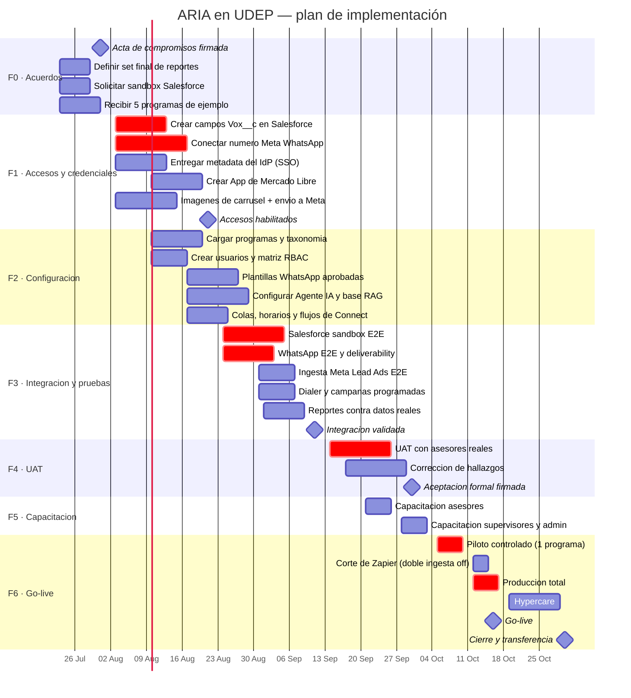
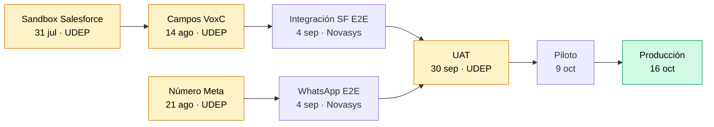

# Plan de implementación — ARIA en UDEP

**Cliente:** Universidad de Piura (UDEP) · **Proveedor:** Novasys
**Producto:** ARIA — plataforma de contact center omnicanal sobre Amazon Connect
**Versión del documento:** 1.0 · **Fecha:** 22 de julio de 2026
**Estado del producto:** los 10 pilares del alcance funcional (R1–R26) están construidos y verificados. Este plan cubre la **activación**, no el desarrollo.

---

## 1. Qué se está implementando y qué no

La distinción es importante para leer el cronograma sin sorpresas.

**Ya construido y verificado (no consume tiempo del plan):** el modelo de Programa, el ledger de golpes, el motor de supresión, la salud del número de WhatsApp, la ingesta nativa de leads de Meta, el inbox omnicanal, la orquestación del dialer, el Agente IA con RAG, el set de reportes y el mapeo schema-aware de Salesforce.

**Lo que sí consume tiempo del plan:** conseguir los accesos y credenciales que solo UDEP puede entregar, cargar la configuración real (programas, plantillas, usuarios, taxonomía), probar de punta a punta contra los sistemas reales de UDEP, capacitar a los asesores y acompañar el arranque.

Dicho de otro modo: **el riesgo del proyecto no es técnico, es de coordinación.** Seis de los siete caminos críticos del cronograma dependen de una acción de UDEP, no de Novasys. Por eso el documento [05-acta-compromisos.md](05-acta-compromisos.md) es el que realmente gobierna la fecha de go-live.

---

## 2. Supuestos del cronograma

Si alguno de estos supuestos no se cumple, la fecha se mueve. Están listados para poder discutirlos antes de firmar, no después.

| #   | Supuesto                                                                                       | Si no se cumple                                                                      |
| --- | ---------------------------------------------------------------------------------------------- | ------------------------------------------------------------------------------------ |
| S1  | UDEP designa un responsable técnico con capacidad de decisión y ~4 h/semana disponibles        | El plan se alarga proporcionalmente a la latencia de respuesta                       |
| S2  | El sandbox de Salesforce está disponible desde el **31 de julio**                              | F3 no puede empezar; se corre todo el bloque de integración                          |
| S3  | Los campos `Vox*__c` se crean en Salesforce antes del **14 de agosto**                         | El write-back de golpes queda inactivo (degrada con gracia, pero R4 no se demuestra) |
| S4  | El número Meta **+51 908 825 660** queda operativo antes del **21 de agosto**                  | No hay estado de entrega por mensaje; el reporte de deliverability queda parcial     |
| S5  | UDEP asigna 3–5 asesores reales para el UAT, con dedicación de media jornada durante 2 semanas | El UAT se hace con datos sintéticos y el riesgo se traslada al go-live               |
| S6  | El 28 y 29 de julio (Fiestas Patrias) no son días hábiles                                      | Ya considerado en el cronograma                                                      |
| S7  | El aprobado de plantillas de Meta demora 48–72 h                                               | Ya considerado; si Meta rechaza, cada reintento suma 2–3 días                        |

---

## 3. Cronograma (Gantt)

---

## 4. Detalle por fase

### F0 · Cierre de acuerdos — 23 al 31 de julio

Es la fase más corta y la más determinante: fija quién entrega qué y cuándo.

| Actividad                                                                            | Responsable                                  | Entregable                         |
| ------------------------------------------------------------------------------------ | -------------------------------------------- | ---------------------------------- |
| Firmar el acta de compromisos con fechas y responsables                              | Zhenia Loyola (UDEP) + Miguel Vega (Novasys) | Acta firmada                       |
| Sesión con Adriana Gómez para cerrar el set final de reportes (**R20**, hoy abierto) | Adriana Gómez + Andre Alata                  | Lista firmada de reportes y campos |
| Solicitar el Developer Sandbox de Salesforce y accesos de admin                      | Carlos Olortiga / Julio (UDEP)               | Credenciales entregadas            |
| Enviar 5 programas de ejemplo y el layout programa ↔ cursos                          | Zhenia Loyola                                | Archivo de ejemplo                 |
| Enviar capturas de los formularios de Meta Lead Ads en uso                           | Adriana Gómez                                | Capturas                           |

**Criterio de salida:** acta firmada y sandbox de Salesforce accesible.

### F1 · Accesos y credenciales — 3 al 21 de agosto

Todo lo de esta fase lo ejecuta UDEP. Novasys acompaña con guías paso a paso, ya escritas.

| Actividad                                                      | Responsable             | Guía                           | Bloquea                   |
| -------------------------------------------------------------- | ----------------------- | ------------------------------ | ------------------------- |
| Crear 7 campos custom `Vox*__c` en el objeto Lead              | Admin Salesforce UDEP   | `design/go-live-runbook.md` §2 | Write-back de golpes (R4) |
| Conectar el número Meta **+51 908 825 660** en modo standalone | Juan Gallardo + Novasys | `design/go-live-runbook.md` §1 | Estado de entrega (R5)    |
| Entregar metadata SAML o credenciales OIDC del IdP             | IT UDEP                 | `design/sso-setup-udep.md`     | Login federado            |
| Crear la App de Mercado Libre y entregar app_id/secret         | UDEP                    | `design/go-live-runbook.md` §4 | Canal Mercado Libre       |
| Entregar 2–3 imágenes por tarjeta de carrusel                  | Marketing UDEP          | `design/go-live-runbook.md` §5 | Plantillas de carrusel    |

**Criterio de salida:** los cinco accesos entregados, o decisión explícita y documentada de dejar alguno fuera del alcance de esta fase.

> **Ventana coordinada requerida.** Repuntar el webhook de WhatsApp es disruptivo: durante el cambio, los mensajes entrantes pueden perderse. Debe hacerse fuera del horario de atención y con aviso previo a los asesores.

### F2 · Configuración — 10 al 28 de agosto

Novasys ejecuta, UDEP valida.

- Carga de los ~56 programas activos con su taxonomía de estados y el mapeo a las unidades de Chattigo (`Humanidades_UDEPP`, `Medicina_UDEPP`, `Idiomas_UDEPP`, `Derecho_UDEPP`, `CCEE_UDEPP`, `Ingeniería_UDEPP`, `Posgrado_UP`).
- Alta de usuarios, asignación de roles y ajuste de la matriz de permisos por rol.
- Plantillas de WhatsApp con la convención de UDEP (`fecha_códigoPrograma_base`) enviadas a aprobación de Meta.
- Configuración del Agente IA: base de conocimiento, guardrails y umbral de confianza para derivar a humano.
- Colas de Amazon Connect, horarios de atención y perfiles de ruteo.

**Criterio de salida:** un asesor puede entrar, ver su cola, atender una conversación de prueba y tipificarla.

### F3 · Integración y pruebas técnicas — 24 de agosto al 11 de septiembre

Aquí se prueba contra los sistemas reales de UDEP, no contra mocks.

| Prueba                                                    | Qué demuestra                                          | Requisito previo         |
| --------------------------------------------------------- | ------------------------------------------------------ | ------------------------ |
| Sincronización bidireccional con el sandbox de Salesforce | R23, R24 — el lead entra, se actualiza y no se duplica | Sandbox + campos creados |
| Golpes escritos en `Vox*__c`                              | R4 — atribución de golpes a conversión                 | Campos creados           |
| Envío de HSM con estado delivered/read                    | R5 — deliverability real                               | Número Meta conectado    |
| Lead de Meta Lead Ads → WhatsApp automático               | R12 — Zapier reemplazado                               | Formularios conectados   |
| Campaña programada que arranca sola dentro de su horario  | Programación con fecha y hora (nuevo)                  | Configuración cargada    |
| Reportes con datos reales de una semana                   | R16–R20                                                | Todo lo anterior         |

**Criterio de salida:** todas las pruebas del [plan de pruebas](04-plan-pruebas-uat.md) en verde, o con desvío aceptado por escrito.

### F4 · UAT con usuarios reales — 14 al 30 de septiembre

Lo ejecutan **asesores de UDEP**, no Novasys. Es la fase que más suele subestimarse.

Paul De Rutte solicitó explícitamente entrevistas con asesores en campo antes de implementar. Esa observación se ejecuta al inicio del UAT: dos jornadas de acompañamiento presencial o remoto para contrastar el flujo diseñado con el trabajo real.

**Criterio de salida:** acta de aceptación firmada, con la lista de hallazgos cerrados y los diferidos acordados.

### F5 · Capacitación — 21 de septiembre al 2 de octubre

Tres audiencias, tres contenidos distintos: asesores (uso diario), supervisores (monitoreo y reportes) y administradores (configuración, campañas, plantillas). Material base ya existente: `docs/ARIA - Manual de usuario.pdf` y `docs/ARIA - Manual interno (Novasys).pdf`.

### F6 · Go-live y estabilización — 5 al 30 de octubre

Arranque escalonado, nunca de golpe:

1. **Piloto (5–9 oct):** un solo programa, un equipo reducido, con Chattigo todavía activo en paralelo.
2. **Corte de Zapier (12–14 oct):** tras confirmar N días de doble ingesta sin pérdida de leads. Se apaga el Zap, no antes.
3. **Producción total (12–16 oct):** todos los programas y todos los asesores.
4. **Hypercare (19–30 oct):** soporte reforzado, revisión diaria de métricas y de la cola de errores.

**Criterio de salida:** dos semanas de operación sin incidentes de severidad alta y transferencia de conocimiento completada.

---

## 5. Ruta crítica

La fecha de go-live depende de esta cadena. Cualquier retraso en un eslabón desplaza el resto día por día:

En ámbar, las tareas cuyo dueño es UDEP. Son cuatro de las siete de la ruta crítica.

---

## 6. Alcance diferido (acordado fuera de esta implementación)

Se documentan aquí para que no reaparezcan como "faltantes" durante el UAT:

| Ítem                                                  | Motivo                                                                                             | Cuándo                    |
| ----------------------------------------------------- | -------------------------------------------------------------------------------------------------- | ------------------------- |
| Comentarios de Instagram a nivel de aplicación        | Requiere App Review de Meta (`instagram_manage_comments`), plazo fuera del control de ambas partes | Cuando Meta apruebe       |
| Sincronización automática de stages Salesforce ↔ ARIA | Decisión del cliente: el stage se crea primero en Salesforce y se replica a mano                   | v2                        |
| Frecuencia de contacto para el canal de voz           | El motor de supresión hoy la aplica a marketing; voz usa la ventana horaria                        | v2                        |
| Pacing predictivo del dialer                          | Requiere volumen histórico que aún no existe                                                       | Tras 2 meses de operación |
| Múltiples proveedores de identidad simultáneos        | El piloto de SSO soporta un IdP configurable                                                       | v2                        |

---

## 7. Documentos relacionados

| Documento                                        | Para qué sirve                                              |
| ------------------------------------------------ | ----------------------------------------------------------- |
| [02-matriz-riesgos.md](02-matriz-riesgos.md)     | Qué puede salir mal, cuánto duele y qué hacemos al respecto |
| [03-analisis-brechas.md](03-analisis-brechas.md) | Qué falta entre lo que hay hoy y lo que UDEP necesita       |
| [04-plan-pruebas-uat.md](04-plan-pruebas-uat.md) | Cómo se verifica que funciona, con criterios de aceptación  |
| [05-acta-compromisos.md](05-acta-compromisos.md) | Quién entrega qué y en qué fecha                            |
| `design/go-live-runbook.md`                      | Procedimiento técnico de activación, paso a paso            |
| `design/sso-setup-udep.md`                       | Guía de configuración del login federado                    |
